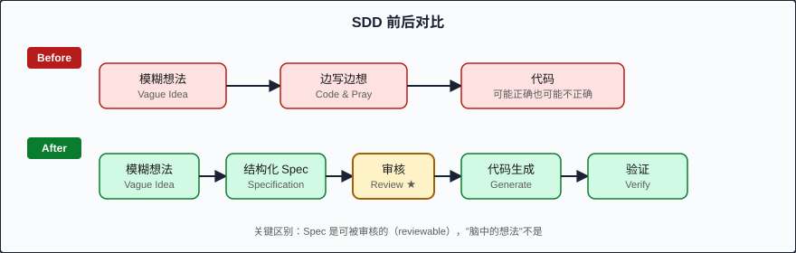

# 第一章：什么是 SDD (What is Spec-Driven Development)

> SDD 的核心主张：Specification 是唯一的事实来源 (single source of truth)，代码不过是从规格派生出的产物 (derived artifact)。

---

## 一个类比：蓝图与建筑

想象你要建造一栋三十层的写字楼。没有人会直接拉着一群工人到工地上说："开始吧，我们边建边看。" 这听起来荒谬，但这恰恰是软件行业在 AI coding agent 时代正在大规模发生的事。

建筑行业在几百年前就学会了一个道理：**blueprint (蓝图) 是建筑的 single source of truth**。工人 (无论多么熟练) 的工作是忠实地将蓝图中的设计变为现实。如果蓝图说承重墙在东侧，没有任何工匠有权凭"感觉"把它移到西侧。

**Spec-Driven Development (SDD，规格驱动开发)** 就是软件工程的 "architectural blueprint" 方法论。在 SDD 中：

- **Specification (规格文档)** 定义了系统的行为、边界、接口和约束
- **Code (代码)** 是从 specification 派生出来的实现产物
- **Drift (偏移)** — 代码与规格之间的任何差异 — 被视为 bug，而非"演进"

---

## SDD 的正式定义

**Spec-Driven Development** 是一种软件开发方法论，其中：

1. 在任何实现开始之前，系统的 expected behavior (预期行为) 以结构化的 specification 文档形式被完整定义
2. Specification 作为 single source of truth，所有的 implementation decisions 必须可追溯到规格中的某个条目
3. 代码的正确性由其与 specification 的一致性来衡量，而非仅由测试通过率来判定
4. 当 specification 与 implementation 产生分歧时，specification 具有最终裁判权 — 除非经过明确的 spec change process

用更简洁的方式表达：

> "Review 3 documents upfront, instead of making hundreds of micro-decisions during implementation."
>
> "在前期审查 3 份文档，而不是在实现过程中做出数百个微决策。"

---

## 历史渊源：SDD 的知识图谱

SDD 并非凭空出现。它站在四位巨人的肩膀上：

### 1. Design-by-Contract (契约式设计) — Bertrand Meyer, 1986

Bertrand Meyer 在设计 Eiffel 语言时提出了 Design-by-Contract (DbC) 的概念。核心思想是：每个软件模块都有明确的 **preconditions (前置条件)**、**postconditions (后置条件)** 和 **invariants (不变量)**。

```eiffel
-- Eiffel 中的 contract
deposit (amount: INTEGER)
  require
    positive_amount: amount > 0
  do
    balance := balance + amount
  ensure
    balance_increased: balance = old balance + amount
  end
```

DbC 给了 SDD 一个关键洞察：**软件的正确性可以被形式化地定义，而不仅仅依赖于 "跑起来没报错"。**

### 2. Literate Programming (文学编程) — Donald Knuth, 1984

Knuth 认为程序首先是写给人看的，其次才是给机器执行的。他的 Literate Programming 将文档和代码交织在一起，让 specification 与 implementation 无缝融合。

SDD 继承了这个精神：**spec 不是额外的负担，它是开发的主线。**

### 3. API-First Design (API 优先设计) — 2010s

OpenAPI (formerly Swagger)、GraphQL Schema Definition Language 等工具让一种实践变得主流：**先定义接口契约 (interface contract)，再实现逻辑。** 前后端团队基于同一份 API spec 并行开发，互不阻塞。

SDD 将 API-First 的理念从"接口层"扩展到了"整个系统"。

### 4. Model-Driven Development (模型驱动开发) — 2000s

MDD 试图用 UML 模型生成代码。虽然 MDD 在工业实践中因过度复杂和 round-tripping 问题而受挫，但它验证了一个方向：**从高层抽象自动生成低层实现是可行的。**

SDD 吸取了 MDD 的教训：不追求完全自动生成，而是用 spec 作为 "guardrail (护栏)" 来约束 AI agent 的输出。

---

## 2025 催化剂：LLM 时代的必然选择

2024-2025 年间，LLM coding agents (如 GitHub Copilot, Cursor, Claude Code) 的能力发生了质的飞跃。它们可以在几分钟内生成数百行代码。这看起来是一场解放，实际上暴露了一个深层问题：

**AI 生成的代码是 "plausible but drifting (看似合理但逐渐偏移的)"。**

一个 AI agent 可以完美地实现你口头描述的功能，但它会在过程中做出无数你从未意识到的 micro-decisions：

- 选择了你不想要的数据库 schema
- 添加了你没有要求的 error handling 策略
- 引入了你不知道的第三方依赖
- 使用了与团队惯例不一致的 naming conventions

当这些 micro-decisions 累积起来，你得到的不是 "你想要的系统"，而是 "AI 认为你想要的系统"。这两者之间的 gap 可能是一个周末的 debugging 地狱。

SDD 的出现正是为了回应这个挑战：**在 AI 动手之前，给它一份明确的、可验证的、人类审核过的 specification。**

---

## 核心价值主张

### 瓶颈洞察 (The Constraint Insight)

> "The bottleneck in software delivery has never been the speed of writing code — it has always been the clarity of what gets built."
>
> "软件交付的瓶颈从来不是写代码的速度 — 而是对构建目标的清晰度。"

在 pre-AI 时代，这个洞察被 "写代码很慢" 的表象所掩盖。程序员花大量时间打字、调试、重构，看起来瓶颈在 implementation。但实际上，绝大多数 rework (返工) 的根因是：

1. Requirements 不够清晰
2. Design decisions 没有被记录
3. 团队成员对 "什么该被建造" 有不同理解

AI agents 消除了打字的瓶颈，却把 "clarity bottleneck (清晰度瓶颈)" 暴露得淋漓尽致。现在代码可以在几秒内生成，但如果方向错了，你只是更快地到达了错误的目的地。

### SDD 的解决方案

SDD 将开发流程从：

```
模糊想法 → 边写边想 → 代码 (可能正确也可能不正确)
```

转变为：

```
模糊想法 → 结构化 Spec → 审核 → 代码生成 → 验证 (与 Spec 一致性检查)
```



关键的区别在于 "审核" 这一步。**Spec 是可被审核的 (reviewable)，而 "脑中的想法" 是不可被审核的。** 当你把想法写成 specification，团队成员 (包括未来的你自己) 才能真正 review 它。

---

## SDD 的三个核心原则

### 原则一：Spec is the Authority (规格即权威)

当代码与 spec 不一致时，代码是错的 — 除非 spec 经过 formal change process 被更新。这消除了 "代码即文档" 的陷阱。

### 原则二：Derivation over Invention (派生优于发明)

每一行代码都应该能追溯到 spec 中的某个需求或决策。如果一段代码无法被追溯，它要么是冗余的，要么是一个未被记录的 decision — 两者都需要处理。

### 原则三：Human Reviews Spec, Machine Generates Code (人类审核规格，机器生成代码)

SDD 并不排斥 AI。恰恰相反，它拥抱 AI 作为 implementation engine，但将 "what to build" 的决策权留给人类。这是一种 separation of concerns：

- **人类的优势**：理解业务上下文、做 tradeoff 决策、预见边缘情况
- **机器的优势**：快速生成代码、保持一致性、不会忘记细节

---

## SDD 不是什么

为了避免误解，让我们澄清 SDD 不是什么：

| SDD 不是... | 因为... |
|---|---|
| Waterfall (瀑布模型) | SDD 的 spec 是 living document，可以迭代更新 |
| 只写文档不写代码 | Spec 的目的是指导实现，不是替代实现 |
| 只适用于大团队 | 独立开发者 + AI agent 的组合最能受益于 SDD |
| 反对 AI | SDD 拥抱 AI 作为实现引擎，只是给它明确的约束 |
| 需要完美的预见性 | Spec 可以是 iterative 的，先定义核心，再逐步扩展 |

---

## 一个最小的 SDD 示例

假设你要构建一个 URL shortener (短链接服务)。在 SDD 中，你不会直接告诉 AI "写一个短链接服务"。你会先写出类似这样的 spec：

```yaml
# url-shortener.spec.yaml
service: URL Shortener
version: 1.0

endpoints:
  - name: shorten
    method: POST
    path: /api/shorten
    input:
      url: string (valid URL, max 2048 chars)
      custom_alias: string? (optional, 3-20 alphanumeric chars)
    output:
      short_url: string
      expires_at: ISO8601 datetime
    constraints:
      - generated alias is 7 chars, base62 encoded
      - collision resolution: retry up to 3 times
      - default TTL: 30 days

  - name: redirect
    method: GET
    path: /:alias
    behavior:
      - lookup alias in store
      - if found and not expired: 301 redirect
      - if not found: 404
      - if expired: 410 Gone

non-functional:
  - p99 latency < 50ms for redirect
  - storage: Redis for hot data, PostgreSQL for persistence
  - rate limit: 100 requests/min per IP for shorten endpoint
```

这份 spec 明确了 AI 在实现时需要遵守的所有约束。当 AI 生成的代码中 default TTL 是 7 天而不是 30 天时，你可以明确指出 "这不符合 spec"。

---

## Key Takeaways (要点回顾)

1. **SDD 将 Specification 视为 single source of truth**，代码是从中派生的产物，而非独立存在的实体
2. **SDD 站在 Design-by-Contract、Literate Programming、API-First 和 MDD 的肩膀上**，但针对 AI agent 时代做了重新适配
3. **2025 年的催化剂是 LLM coding agents**：它们暴露了 "clarity bottleneck" — 快速生成代码的能力反而让需求模糊性的代价变得更高
4. **核心价值：前期审查 3 份文档，胜过实现过程中的数百个未经审查的 micro-decisions**
5. **SDD 是建筑蓝图的软件等价物**：它不限制创造力，而是为创造力提供明确的边界

---

## Next (下一章)

在 [Chapter 02: Vibe Coding 的七宗罪](02-vibe-coding-failure.md) 中，我们将深入分析没有 specification 约束的 AI coding 会产生哪些具体的、可重复的失败模式 — 以及 SDD 如何系统性地预防它们。
