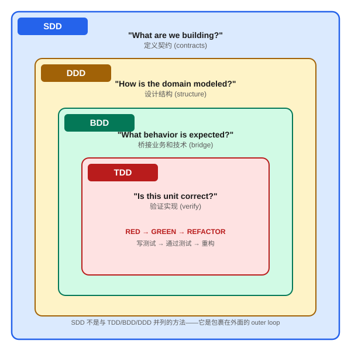

# 第三章：方法论对比 (SDD vs TDD vs BDD vs DDD)

> SDD 不是替代现有方法论的 "新银弹"，而是一个 outer loop (外层循环)，将 TDD、BDD、DDD 统一在 specification 的框架之下。

---

## 四种方法论的核心问题

每种软件开发方法论都试图回答一个核心问题。理解这个问题的差异，就理解了它们各自的定位：

| 方法论 | 核心问题 | 验证方式 |
|--------|----------|----------|
| **TDD** | "这段实现是否正确？" (Is this implementation correct?) | 自动化测试 (unit tests) |
| **BDD** | "这是否匹配期望的行为？" (Does this match expected behavior?) | Given-When-Then 场景 |
| **DDD** | "我们是否在解决正确的问题域？" (Are we modeling the right domain?) | 统一语言 (Ubiquitous Language) |
| **SDD** | "这是否是我们约定要构建的？" (Is this what we agreed to build?) | Spec-Implementation 一致性 |

注意这些问题的 **粒度 (granularity)** 和 **时间点 (timing)** 的差异 — 这正是四者互补的基础。

---

## TDD: Test-Driven Development (测试驱动开发)

### 核心循环

```
RED   → 写一个失败的测试
GREEN → 写最少的代码使测试通过
REFACTOR → 重构，保持测试绿色
```

### TDD 的优势

- **Micro-level correctness (微观正确性)**：每个函数、每个方法都有对应的测试保证
- **Refactoring confidence (重构信心)**：有了测试网，你可以放心重构
- **Design pressure (设计压力)**：难以测试的代码通常也是设计不好的代码

### TDD 的盲区

TDD 回答的是 "实现是否正确"，但它有一个隐含的前提：**你知道正确的 test 该怎么写。**

问题是：当你在一个 AI agent 驱动的工作流中，谁来决定 test cases？如果 AI 既写实现又写测试 (如 [Chapter 02](02-vibe-coding-failure.md) 的第四宗罪所示)，TDD 就退化为 self-validation。

```typescript
// TDD 假设：开发者知道正确的行为
test('expired token returns 401', () => { ... })

// 但如果开发者 (或 AI) 根本不知道还有 timing attack 的 case？
// TDD 不会告诉你 "你遗漏了什么测试"
```

**TDD 是 specification 的消费者，不是生产者。** 它验证 "已知的需求"，但无法发现 "未被考虑的需求"。

---

## BDD: Behavior-Driven Development (行为驱动开发)

### 核心格式

```gherkin
Feature: User Authentication
  Scenario: Successful login
    Given a registered user with email "alice@example.com"
    When they submit correct credentials
    Then they receive a valid session token
    And the token expires in 24 hours
```

### BDD 的优势

- **Business-readable (业务可读)**：非技术 stakeholders 能理解 scenarios
- **Living documentation (活文档)**：scenarios 既是测试又是文档
- **Shared understanding (共享理解)**：开发者和产品经理使用同一语言

### BDD 的盲区

BDD 专注于 **behavioral scenarios (行为场景)**，但它不定义：

- System architecture (系统架构如何划分？)
- Non-functional requirements (性能要求是什么？)
- Implementation constraints (必须用什么技术栈？)
- Integration contracts (与第三方如何对接？)

BDD 的 Given-When-Then 格式非常适合描述 "用户可见的行为"，但对于 "系统内部的约束" 则力不从心：

```gherkin
# BDD 能表达这个：
Scenario: Rate limited user gets 429
  Given a user who made 100 requests in the last minute
  When they make another request
  Then they receive a 429 response

# BDD 难以表达这个：
# "Rate limiting uses token bucket algorithm with
#  bucket size 100, refill rate 10/sec,
#  implemented via Redis MULTI/EXEC for atomicity,
#  with fallback to in-memory counter if Redis is down"
```

---

## DDD: Domain-Driven Design (领域驱动设计)

### 核心概念

- **Ubiquitous Language (统一语言)**：团队所有人使用相同的术语
- **Bounded Contexts (限界上下文)**：大系统分解为自治的子域
- **Aggregates (聚合)**：事务一致性的边界
- **Domain Events (领域事件)**：子系统间的通信机制

### DDD 的优势

- **Problem-space clarity (问题空间清晰)**：确保你在解决正确的问题
- **Team boundaries (团队边界)**：bounded contexts 对应团队结构
- **Complexity management (复杂度管理)**：将大问题分解为可管理的部分

### DDD 的盲区

DDD 关注的是 "我们如何理解和建模问题域"，但它不直接告诉你：

- 具体的 API 契约长什么样
- 每个 endpoint 的 validation rules 是什么
- Error handling 策略的细节
- 部署和 infrastructure 的要求

DDD 是 **战略级 (strategic)** 的 — 它告诉你怎么分 contexts、怎么命名 entities，但从 domain model 到 production code 之间，还有很大的 gap 需要填充。

---

## SDD: Spec-Driven Development (规格驱动开发)

### 核心机制

```
SPECIFY  → 写完整的 specification (接口、行为、约束、non-functionals)
REVIEW   → 人类审核 spec (确保意图正确)
GENERATE → AI (或人类) 从 spec 派生 implementation
VALIDATE → 验证 implementation 与 spec 的一致性
```

### SDD 的独特定位

SDD 不是在 TDD/BDD/DDD 的 "旁边" 加了一种新方法。它是 **包裹在外面的 outer loop**：

```
┌─────────────────────────────────────────┐
│  SDD: "What are we building?"           │
│                                         │
│  ┌───────────────────────────────────┐  │
│  │  DDD: "How is the domain modeled?"│  │
│  │                                   │  │
│  │  ┌─────────────────────────────┐  │  │
│  │  │  BDD: "What behavior is     │  │  │
│  │  │       expected?"             │  │  │
│  │  │                             │  │  │
│  │  │  ┌───────────────────────┐  │  │  │
│  │  │  │  TDD: "Is this unit  │  │  │  │
│  │  │  │       correct?"      │  │  │  │
│  │  │  └───────────────────────┘  │  │  │
│  │  └─────────────────────────────┘  │  │
│  └───────────────────────────────────┘  │
└─────────────────────────────────────────┘
```



- **DDD** 设计结构 (structure)
- **SDD** 定义契约 (contracts)
- **BDD** 桥接业务和技术 (bridge)
- **TDD** 验证实现 (verify)

---

## 对比矩阵

| 维度 | TDD | BDD | DDD | SDD |
|------|-----|-----|-----|-----|
| **定义时机** | 编码同时 | 需求分析时 | 系统设计时 | 实现之前 |
| **产出物** | Unit tests | Scenarios | Domain model | Full specification |
| **粒度** | 函数/方法 | 用户故事 | 子域/聚合 | 整个系统 |
| **验证对象** | 代码正确性 | 行为正确性 | 模型正确性 | 全局一致性 |
| **主要受众** | 开发者 | 开发者+产品 | 架构师+领域专家 | 所有 stakeholders |
| **AI 时代适应性** | 中 (AI 可写 tests) | 中 (AI 可写 scenarios) | 高 (不涉及代码) | 极高 (专为 AI 设计) |
| **防止 drift** | 局部 | 行为层 | 结构层 | 全局 |
| **学习曲线** | 低 | 中 | 高 | 中 |

---

## 四者如何协同工作

一个完整的开发流程可能同时使用全部四种方法论：

### Phase 1: DDD — 理解问题域

```
Domain Expert 会议 → Ubiquitous Language 定义 → Bounded Context 划分
产出: Domain model, context map, entity definitions
```

### Phase 2: SDD — 定义完整规格

```
基于 domain model → 写出 API contracts, data schemas,
non-functional requirements, integration points
产出: Comprehensive specification documents
```

### Phase 3: BDD — 桥接业务场景

```
基于 spec → 写出 Given-When-Then scenarios
确保业务 stakeholders 认同 expected behaviors
产出: Executable scenarios (Gherkin files or equivalent)
```

### Phase 4: TDD — 驱动实现

```
基于 scenarios + spec → 写 unit tests (RED)
→ 实现代码 (GREEN) → 重构 (REFACTOR)
产出: Tested implementation code
```

### 信息流

```
DDD ──structure──→ SDD ──contracts──→ BDD ──scenarios──→ TDD ──tests──→ Code
 │                  │                  │                  │
 │                  │                  │                  │
 └── "What domain?" └── "What exactly?"└── "What behavior?"└── "Is it correct?"
```

---

## 关键洞察：SDD 回答了一个之前无人回答的问题

在 AI agent 时代之前，TDD + BDD + DDD 的组合已经相当完善。但 AI coding agents 引入了一个新的 gap：

> **谁来确保 AI 的 hundreds of micro-decisions 与人类的 intent 一致？**

- TDD 能验证 "这段代码做了它被测试的事"，但不能验证 "这段代码应该做这些事而非其他事"
- BDD 能验证 "用户可见的行为是对的"，但不能验证 "内部实现的约束被遵守了"
- DDD 能确保 "我们在解决对的问题"，但从 domain model 到 code 的距离太远

SDD 填补了这个 gap：**它是 AI agent 的 "操作手册"，明确定义了 implementation 的所有 boundaries 和 constraints。**

---

## 何时使用哪种方法论 (Decision Guide)

### 单独使用 TDD 就够了：

- 明确的算法实现 (sorting, parsing, math)
- 纯函数、无副作用的工具代码
- 规格已经非常清楚、无歧义
- 单人项目，你就是所有 spec 的持有者

### 需要加入 BDD：

- 多个 stakeholders 需要理解和认同行为
- Business rules 复杂且有边缘情况
- QA 团队需要从 scenarios 派生测试计划
- 需要 "活文档" 来替代过时的需求文档

### 需要加入 DDD：

- 问题域复杂 (金融、医疗、物流等)
- 多团队需要划分 ownership boundaries
- 术语混乱导致沟通成本高
- 系统需要长期演进而非一次性交付

### 需要加入 SDD：

- 使用 AI coding agents (Copilot, Cursor, Claude Code 等)
- 项目需要明确的 "source of truth" 来对抗 drift
- 团队成员 (人或 AI) 需要独立工作但保持一致
- 架构决策需要被持久化和强制执行
- 非功能需求 (性能、安全、兼容性) 不能被 "遗忘"

### 全部四种一起用：

- 大型企业系统
- 高风险领域 (金融交易、医疗设备)
- 多团队 + AI agents 协作
- 需要审计追踪 (每个决策都需要可追溯)

---

## 常见误解

### "SDD 会不会和 TDD 冲突？"

不会。SDD 告诉你 "测试什么 (what to test)"，TDD 告诉你 "怎么用测试驱动实现 (how to drive implementation with tests)"。它们是不同层面的工具。

### "先写 spec 不就是 Waterfall 吗？"

不是。Waterfall 的问题是 "一次性写完所有需求，然后不允许修改"。SDD 的 spec 是 iterative 的 — 你可以先写 core spec，实现后发现新洞察，再更新 spec。关键区别是 **spec 的修改是 explicit 和 tracked 的**，而不是代码悄悄 drift。

### "DDD 的 domain model 不就是一种 spec 吗？"

DDD 的 domain model 是 spec 的一个 **组成部分**，但不是全部。Domain model 定义了 entities 和 relationships，但它不定义 API contracts、error codes、rate limits、deployment constraints 等。SDD 的 spec 覆盖了从 domain 到 infrastructure 的完整 stack。

---

## Key Takeaways (要点回顾)

1. **TDD、BDD、DDD、SDD 回答不同层面的问题** — implementation correctness、behavioral correctness、domain modeling correctness、global specification compliance
2. **SDD 是 outer loop**，包含并指导其他三种方法论，而非替代它们
3. **信息流方向：DDD → SDD → BDD → TDD → Code**，每一层为下一层提供约束和指导
4. **SDD 特别适合 AI agent 时代**，因为它填补了 "谁来验证 AI 的 micro-decisions" 这个 gap
5. **根据项目的复杂度、风险等级和团队构成**，选择使用一种或多种方法论的组合

---

## Next (下一章)

在 [Chapter 04: 三层严格度模型](04-three-rigor-levels.md) 中，我们将探讨 SDD 内部的频谱 — 从最轻量的 "Spec-First" 到最激进的 "Spec-As-Source"，帮你找到适合自己项目的 rigor level。
