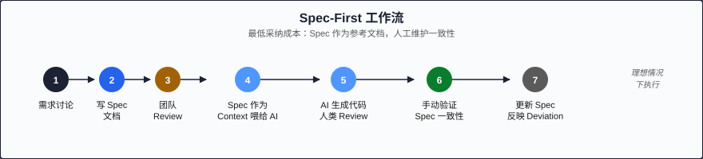

# 第四章：三层严格度模型 (Three Levels of SDD Rigor)

> SDD 不是一个非黑即白的选择。它是一个频谱 (spectrum)，从轻量的 "先写 spec 再写代码" 到激进的 "spec 即源码、代码全生成"。选择正确的 rigor level 是成功采用 SDD 的关键。

---

## 频谱的必要性

如果 SDD 只有一种模式 — "把所有代码都变成 generated artifact" — 它将只适合极少数项目。现实中，不同项目有不同的风险等级、团队规模和技术成熟度。

Martin Fowler 团队在 2025 年的 Thoughtworks Technology Radar 中提出了 SDD 的三层分类法 (taxonomy)。这个框架帮助团队根据实际情况选择合适的 "规格严格度"：

| Level | 名称 | 核心理念 | 复杂度 |
|-------|------|----------|--------|
| 1 | **Spec-First** (规格优先) | 先写 spec，再手写代码 | 低 |
| 2 | **Spec-Anchored** (规格锚定) | Spec 驱动生成，与手写代码共存 | 中 |
| 3 | **Spec-As-Source** (规格即源码) | Spec 就是产品，代码完全生成 | 高 |

---

## Level 1: Spec-First (规格优先)

### 定义与特征

**Spec-First** 是 SDD 最轻量的形式：在写任何实现代码之前，先完成一份 specification 文档。之后，代码仍然是人类 (或 AI 在人类指导下) 手写的，spec 作为 reference document (参考文档) 存在。

核心特征：
- Specification 先于 implementation 被写出
- 代码是 primary maintained artifact (主要维护产物)
- Spec 可能随代码演进而更新，也可能逐渐 stale (过时)
- 没有自动化的 spec-code consistency check
- 依赖人工 review 来维持一致性

### 适用场景

- **团队刚开始探索 SDD**，需要最低的采纳成本
- **小型项目** (1-3 人)，spec 的更新成本可以被人工覆盖
- **已有大量 legacy code**，无法一次性引入重量级工具
- **使用任何 AI 工具** — Copilot、ChatGPT、Claude，不需要特殊集成
- **风险较低的功能**：内部工具、admin panels、non-critical services

### 工作流示例

```
Step 1: 需求讨论
  ↓
Step 2: 写 spec 文档 (Markdown, YAML, 或结构化模板)
  ↓
Step 3: 团队 review spec (async PR review 或 sync meeting)
  ↓
Step 4: 将 spec 作为 context 喂给 AI agent
  ↓
Step 5: AI 生成代码，人类 review
  ↓
Step 6: 手动验证代码与 spec 的一致性
  ↓
Step 7: (理想情况) 更新 spec 以反映任何 deviation
```



### 实际示例

一个典型的 Spec-First 场景 — 你要为 notification service 添加一个 webhook delivery 功能：

```markdown
# Webhook Delivery Spec

## Overview
Add webhook delivery capability to the existing notification service.

## API Contract
POST /api/webhooks
  Body: { url: string, events: string[], secret: string }
  Response: 201 { id, url, events, created_at }

## Delivery Behavior
- On event trigger: POST to registered URL with JSON payload
- Include X-Signature header (HMAC-SHA256 of body using secret)
- Retry policy: 3 attempts, exponential backoff (1s, 5s, 25s)
- Timeout: 10 seconds per attempt
- Mark webhook as "failing" after 5 consecutive failures

## Out of Scope
- Webhook management UI (separate task)
- Bulk webhook registration
- Custom retry policies per webhook
```

你把这份 spec 贴到 AI agent 的 prompt 中，然后说 "implement this according to the spec"。AI 的输出以 spec 为约束，你在 review 时对照 spec 检查。

### 工具要求

几乎为零。你需要的只是：
- 一个文本编辑器 (写 spec)
- 一个 AI coding tool (任何一种)
- Code review 流程 (GitHub PR 或等价物)

### Tradeoffs

| 优势 | 劣势 |
|------|------|
| 零工具投入 | Spec 可能逐渐与代码 drift |
| 立即可用 | 一致性依赖人工 discipline |
| 适合任何技术栈 | 没有自动化 enforcement |
| 低学习曲线 | Spec 更新可能被 "遗忘" |
| 增量采用 | 无法保证 100% compliance |

---

## Level 2: Spec-Anchored (规格锚定)

### 定义与特征

**Spec-Anchored** 是中间地带：Specification 不仅是 reference document，它还 actively drives (主动驱动) code generation，并且有 tooling 来监控 spec 与 code 之间的 drift。

核心特征：
- Spec 驱动部分代码的自动生成 (types, API stubs, validation schemas)
- 手写代码与生成代码共存
- 有 CI-level checks 来检测 spec-code drift
- Spec 是 "anchor (锚点)" — 允许一定程度的 deviation，但 deviation 必须被 acknowledged
- 需要中等程度的 tooling 投入

### 适用场景

- **中型团队** (3-10 人)，需要跨成员的一致性保证
- **API-heavy projects**：前后端分离、微服务间通信
- **Medium-risk systems**：面向客户的产品、SaaS 平台
- **已有 schema-driven workflow** 的团队 (OpenAPI, GraphQL SDL, Protobuf)
- **AI agent 深度集成**：使用 Claude Code + CLAUDE.md, Cursor + AGENTS.md 等

### 工作流示例

```
Step 1: 写 specification (structured format: YAML, OpenAPI, custom DSL)
  ↓
Step 2: 工具从 spec 自动生成:
        - TypeScript interfaces / types
        - API route stubs
        - Validation schemas (Zod, Joi, etc.)
        - Database migration drafts
  ↓
Step 3: 开发者在 generated stubs 内填写 business logic
  ↓
Step 4: AI agent 在 spec 约束下生成复杂逻辑
  ↓
Step 5: CI pipeline 运行 spec-drift detection:
        - "Spec says endpoint returns 404, but code returns 400"
        - "Spec requires field 'created_at', but type definition is missing it"
  ↓
Step 6: Drift alerts 必须被 resolve:
        - 修改代码以匹配 spec, OR
        - 更新 spec (with explicit approval) 以匹配代码
```

### 实际示例

使用 OpenAPI + code generation 的 Spec-Anchored 工作流：

```yaml
# api-spec.openapi.yaml
openapi: 3.1.0
paths:
  /api/users/{id}:
    get:
      operationId: getUser
      parameters:
        - name: id
          in: path
          required: true
          schema:
            type: string
            format: uuid
      responses:
        '200':
          content:
            application/json:
              schema:
                $ref: '#/components/schemas/User'
        '404':
          description: User not found
        '401':
          description: Unauthorized

components:
  schemas:
    User:
      type: object
      required: [id, email, created_at]
      properties:
        id:
          type: string
          format: uuid
        email:
          type: string
          format: email
        display_name:
          type: string
          nullable: true
        created_at:
          type: string
          format: date-time
```

从这份 spec 自动生成：

```typescript
// generated/types.ts — DO NOT EDIT MANUALLY
export interface User {
  id: string    // uuid
  email: string // email format
  display_name: string | null
  created_at: string // ISO8601
}

// generated/routes.ts — DO NOT EDIT MANUALLY
export interface GetUserRoute {
  params: { id: string }
  response: {
    200: User
    404: { message: string }
    401: { message: string }
  }
}
```

开发者只需要在 generated framework 中填写实现：

```typescript
// src/handlers/get-user.ts — THIS file is manually maintained
import { GetUserRoute } from '../generated/routes'

export const getUserHandler: Handler<GetUserRoute> = async (req) => {
  const user = await db.users.findById(req.params.id)
  if (!user) return { status: 404, body: { message: 'User not found' } }
  return { status: 200, body: user }
}
```

### Drift Detection 机制

CI 中运行的 drift check 可能发出这样的警告：

```
⚠️ SPEC DRIFT DETECTED:
  - api-spec.yaml defines GET /api/users/{id} response 404
  - But src/handlers/get-user.ts returns 400 for missing user
  - Action required: align code or update spec

⚠️ TYPE DRIFT DETECTED:
  - api-spec.yaml requires field "created_at" on User
  - But database migration 003 does not include this column
  - Action required: add migration or update spec
```

### 工具要求

中等投入：
- Spec 编写工具 (OpenAPI Editor, custom DSL)
- Code generator (openapi-generator, graphql-codegen, Protobuf compiler)
- Drift detection CI check (custom script 或 spec-drift tools)
- AI agent configuration (CLAUDE.md / AGENTS.md with spec references)

### Tradeoffs

| 优势 | 劣势 |
|------|------|
| 自动化的一致性保证 | 需要 tooling 投入 |
| Generated types 消除了手动同步 | 初始 setup 成本较高 |
| CI-level drift detection | 需要维护 generator 配置 |
| 手写代码保持灵活性 | 两种代码 (生成+手写) 共存增加复杂度 |
| 渐进式采用 | Spec 格式选择需要前期决策 |

---

## Level 3: Spec-As-Source (规格即源码)

### 定义与特征

**Spec-As-Source** 是最激进的形式：Specification 就是最终产品 (the product IS the spec)。所有可执行代码都是从 spec 完全生成的，生成的代码标记为 "DO NOT EDIT"，任何手动修改都会在下次生成时被覆盖。

核心特征：
- Spec 是唯一被人类编辑的 artifact
- 100% 的代码由 generation pipeline 生成
- 生成的代码有 "DO NOT EDIT" 标记或放在 `.gitignore` 中
- 修改系统行为 = 修改 spec + 重新生成
- 需要高度成熟的 tooling 和 generation infrastructure

### 适用场景

- **高度 regulated environments (受监管环境)**：金融合规、医疗设备
- **CRUD-heavy applications**：admin dashboards, internal tools
- **API gateway configurations**：路由、认证、rate limiting
- **Infrastructure as Code**：已经在 IaC 中实践的理念
- **Experimental/research projects**：快速迭代 spec，不关心 code quality

### 工作流示例

```
Step 1: 编辑 specification (唯一的人类编辑点)
  ↓
Step 2: Generation pipeline 运行:
        - Parser 验证 spec syntax & semantics
        - Generator 产出完整的 source code
        - Formatter 格式化生成的代码
        - Test generator 产出测试代码
  ↓
Step 3: 自动运行生成的 tests
  ↓
Step 4: 如果 tests 通过 → deploy
        如果 tests 失败 → 回到 Step 1 修改 spec
  ↓
Step 5: 永远不要手动编辑 generated code
```

### 历史案例：Tessl 的探索与转型

Tessl (原名 Hype) 是 2024-2025 年间最具雄心的 Spec-As-Source 实践者。他们的愿景是：

> "开发者只写 spec，AI 生成整个应用，包括 tests、deployment config、monitoring。"

Tessl 的 pipeline：

```
Natural Language Spec → Structured Intent → Code Generation → Auto-Testing → Deployment
```

然而 Tessl 在 2025 年底 pivoted (转型)，转向了更 Spec-Anchored 的方式。他们公开分享的教训：

1. **Long-tail behaviors** 极难在 spec 中完整表达
2. **Performance tuning** 往往需要 implementation-level knowledge
3. **Third-party integrations** 充满了 undocumented behaviors
4. **Developer resistance** — 高级工程师不愿放弃对 code 的直接控制

### 当前可行的 Spec-As-Source 场景

虽然 "通用 Spec-As-Source" 还不成熟，但在特定领域它已经在生产中运行：

```yaml
# Terraform — Infrastructure as Code (IaC)
# 这就是 Spec-As-Source: 你编辑 .tf 文件，terraform apply 生成实际基础设施
resource "aws_lambda_function" "api" {
  function_name = "my-api"
  runtime       = "nodejs20.x"
  handler       = "index.handler"
  memory_size   = 256
  timeout       = 30
}
```

```protobuf
// Protobuf — API contract as source
// 你编辑 .proto 文件，protoc 生成所有语言的 client/server code
service UserService {
  rpc GetUser (GetUserRequest) returns (User);
  rpc CreateUser (CreateUserRequest) returns (User);
}
```

```graphql
# GraphQL SDL — Schema as source
# 你编辑 schema，code generators 产出 types, resolvers, clients
type User {
  id: ID!
  email: String!
  posts: [Post!]!
}
```

### 工具要求

高投入：
- Custom DSL 或 highly-structured spec format
- Robust code generation pipeline
- Comprehensive test generation
- CI/CD integration with "regenerate on spec change"
- Escape hatches (逃逸机制) for edge cases that spec cannot express

### Tradeoffs

| 优势 | 劣势 |
|------|------|
| Spec 和 Code 永远一致 | 需要高度成熟的 generation tooling |
| 审计追踪极其清晰 | 某些 edge cases 难以在 spec 中表达 |
| 开发者只需关注 "what"，不需要 "how" | 开发者学习曲线高 (new mental model) |
| 生成的代码可以整体优化 | Generation pipeline 本身成为新的维护负担 |
| 适合受监管环境 | 调试困难 (debugging generated code) |
| 技术栈迁移成本极低 (重新生成即可) | 当前工具成熟度有限 |

---

## 三层模型的选择指南

### 决策矩阵

| 因素 | Spec-First | Spec-Anchored | Spec-As-Source |
|------|-----------|---------------|----------------|
| 团队规模 | 1-3 人 | 3-10 人 | 10+ 人或特殊场景 |
| 项目风险 | 低-中 | 中-高 | 高-极高 |
| AI 依赖程度 | 轻度 | 中度 | 重度 |
| 工具投入 | 几乎为零 | 中等 | 高 |
| 一致性保证 | 人工 | 半自动 | 全自动 |
| 适合阶段 | MVP / 探索 | 产品成长期 | 成熟 / 合规 |

### 渐进式采用路径

大多数团队应该从 Level 1 开始，逐步升级：

```
Phase 1 (Week 1-4):   Spec-First
  目标: 养成 "先写 spec" 的习惯
  工具: Markdown + 任何 AI tool

Phase 2 (Month 2-3):  Spec-Anchored (部分)
  目标: API contracts 自动生成 types
  工具: OpenAPI/GraphQL + code generators

Phase 3 (Month 4+):   Spec-Anchored (完整)
  目标: CI drift detection, AI agent 配置
  工具: Custom drift checks + CLAUDE.md

Phase 4 (可选):       Spec-As-Source (特定子系统)
  目标: 某些 CRUD 模块完全从 spec 生成
  工具: Custom generation pipeline
```

---

## 本教程的定位

本教程系列主要聚焦于 **Level 2: Spec-Anchored** — 这是当前 (2026年) 大多数团队最能受益的 sweet spot：

- 足够的 rigor 来防止 [七宗罪](02-vibe-coding-failure.md) 中描述的问题
- 不需要激进的工具投入
- 与 Claude Code + CLAUDE.md 的 native workflow 天然契合
- 允许渐进式采用，不需要 "big bang" 转换

在后续章节中，我们将具体展示如何在 Claude Code 中实现 Spec-Anchored 工作流。

---

## Key Takeaways (要点回顾)

1. **SDD 有三个 rigor levels**：Spec-First (先写 spec)、Spec-Anchored (spec 驱动 + drift 监控)、Spec-As-Source (spec 即源码)
2. **Spec-First 适合入门** — 零工具成本，只需要养成 "spec before code" 的习惯
3. **Spec-Anchored 是当前的 sweet spot** — 在 automation 和 flexibility 之间取得平衡，适合大多数使用 AI agent 的团队
4. **Spec-As-Source 是未来方向** — 目前仅在特定领域 (IaC, API contracts) 成熟，通用场景还需要工具演进
5. **渐进式采用是正确策略** — 从 Level 1 开始，随着团队成熟度提升逐步升级

---

## Next (下一章)

在 [Chapter 05: SDD 工具生态全景](05-sdd-ecosystem.md) 中，我们将纵览 2026 年的 SDD tool landscape — 从 GitHub Spec Kit 到 AWS Kiro，从 BMAD-METHOD 到 Claude Code Native — 帮你找到最适合你场景的工具组合。
