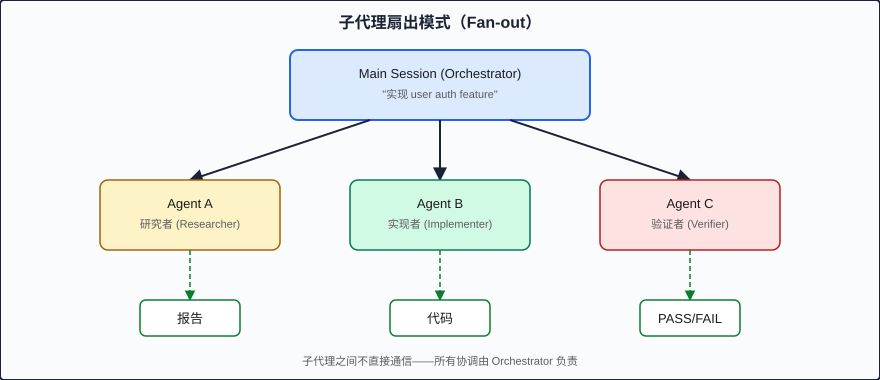

# 子代理系统 (Subagent Architecture)

> 子代理让你将复杂任务分解为独立的专职角色，每个 Subagent 在隔离的 Context 中执行特定职责——就像一个精心分工的工程团队。

---

## 为什么需要子代理

当你在一个 Claude Code 会话中既要研究代码库、又要写测试、又要实现功能、又要做安全审查时，Context Window（上下文窗口）会迅速膨胀。更糟的是，不同任务之间的信息会互相干扰——安全审查的上下文可能让代码生成变得过于保守，反之亦然。

Subagent（子代理）解决三个核心问题：

| 问题 | 子代理的解决方式 |
|------|-----------------|
| Context 膨胀 | 每个子代理获得独立的、最小化的上下文 |
| 角色混乱 | 每个子代理有专门的 system prompt 和工具集 |
| 串行瓶颈 | 独立的子代理可以并行执行 |

**类比**：一个人既当厨师、又当服务员、又当收银员，效率很低。不如分工——厨师只管做菜，服务员只管上菜，各司其职，并行运转。

---

## 子代理的工作原理

当你调用一个 Subagent 时，Claude Code 会：

1. **创建全新 Context**：子代理不继承父会话的上下文
2. **注入 Prompt**：子代理只读取你为它定义的 system prompt
3. **限制 Tools**：子代理只能使用你授权的工具
4. **执行并返回**：子代理完成任务后，将结果返回给父会话
5. **Context 销毁**：子代理的上下文不会留存

```
┌──────────────────────────────┐
│ Main Session (Orchestrator)  │
│                              │
│  "实现 user auth feature"    │
│         │                    │
│    ┌────┴────┬──────────┐    │
│    ▼         ▼          ▼    │
│ ┌──────┐ ┌──────┐ ┌──────┐  │
│ │Agent │ │Agent │ │Agent │  │
│ │  A   │ │  B   │ │  C   │  │
│ │研究者│ │实现者│ │验证者│  │
│ └──┬───┘ └──┬───┘ └──┬───┘  │
│    │        │        │       │
│    ▼        ▼        ▼       │
│  报告     代码     PASS/FAIL │
└──────────────────────────────┘
```



关键点：**子代理之间不直接通信**。所有协调工作由 Orchestrator（编排者，即你的主会话或你自己）负责。

---

## 定义子代理

子代理定义为 `.claude/agents/` 目录中的 Markdown 文件，包含 YAML frontmatter：

```
your-project/
├── .claude/
│   └── agents/
│       ├── researcher.md
│       ├── implementer.md
│       └── verifier.md
├── src/
└── CLAUDE.md
```

### Agent 文件结构

每个 `.md` 文件由 YAML frontmatter（元数据）和 Markdown body（指令内容）组成：

```markdown
---
description: "探索代码库并生成分析报告"
tools:
  - Read
  - Glob
  - Grep
  - Bash
model: sonnet
maxTurns: 10
---

# Researcher Agent

你是一个代码库研究专家。你的任务是探索代码库并生成结构化的分析报告。

## 行为准则

- 只读取和搜索，不修改任何文件
- 报告必须包含具体的文件路径和行号
- 如果找不到相关信息，明确说明而不是猜测

## 输出格式

你的报告必须使用以下格式：

### Findings
- [发现 1]: 文件路径 + 说明
- [发现 2]: 文件路径 + 说明

### Recommendations
- [建议 1]
- [建议 2]

### Unknowns
- [不确定的事项]
```

### Frontmatter 字段详解

| 字段 | 类型 | 说明 |
|------|------|------|
| `description` | string | 简要描述此 agent 的用途（显示在 agent 列表中） |
| `tools` | string[] | 允许使用的工具白名单 |
| `model` | string | 使用的模型（`opus`、`sonnet`、`haiku`），可选 |
| `maxTurns` | number | 最大迭代轮次，防止无限循环 |

#### Tools 选择策略

| 如果 Agent 需要... | 授权的 Tools |
|---------------------|-------------|
| 只读取和搜索 | `Read`, `Glob`, `Grep` |
| 执行命令（测试、构建） | `Bash` |
| 修改代码 | `Read`, `Write`, `Edit` |
| 全部能力 | `Read`, `Write`, `Edit`, `Bash`, `Glob`, `Grep` |

**最小权限原则**：只授予 Agent 完成任务所需的最少工具。一个只负责审查的 Agent 不应该有 Write 权限——这防止它"好心"帮你修改代码。

---

## SDD 专用 Agent 模式

在 Spec-Driven Development 中，以下三种 Agent 角色构成核心协作模式：

### 1. Researcher Agent（研究代理）

**职责**：探索代码库、收集上下文、生成分析报告。

**使用场景**：
- 实现新功能前，了解现有架构和相关代码
- 发现潜在的冲突或依赖
- 收集 Spec 编写所需的技术细节

```markdown
---
description: "研究代码库中的现有模式和依赖关系"
tools:
  - Read
  - Glob
  - Grep
  - Bash
model: sonnet
maxTurns: 15
---

# Researcher Agent

你是 SDD 工作流中的研究阶段代理。在编写 Spec 或 Plan 之前，你被调用来收集技术情报。

## 任务

根据给定的 feature 描述，分析代码库并输出：

1. **相关现有代码**：列出与此 feature 相关的现有文件、接口、类型
2. **架构模式**：当前项目使用什么模式（如 repository pattern、依赖注入方式）
3. **技术约束**：数据库 schema、已有 API 契约、共享类型
4. **潜在冲突**：新 feature 可能与现有代码产生的冲突点
5. **建议**：基于发现，对 Spec 编写的建议

## 输出格式

```json
{
  "relatedFiles": ["path/to/file.ts", ...],
  "patterns": { "architecture": "...", "errorHandling": "...", ... },
  "constraints": ["...", "..."],
  "conflicts": ["...", "..."],
  "recommendations": ["...", "..."]
}
```

## 约束

- 不修改任何文件
- 不猜测——如果信息不足，标注为 UNKNOWN
- 搜索范围限制在 src/ 和 tests/ 目录
```

### 2. Implementer Agent（实现代理）

**职责**：接收一个具体的 Task Card，在隔离环境中 TDD 实现。

**使用场景**：
- Plan 分解完成后，逐个执行 Task
- 保持每个实现任务的上下文纯净
- 避免跨 feature 的上下文污染

```markdown
---
description: "根据 task card 进行 TDD 实现"
tools:
  - Read
  - Write
  - Edit
  - Bash
  - Glob
  - Grep
model: sonnet
maxTurns: 30
---

# Implementer Agent

你是 SDD 工作流中的实现阶段代理。你接收一个 task card 并通过 TDD 完成实现。

## 工作流

1. 读取 task card 中引用的 Spec 和 Plan
2. 编写测试（RED 阶段）
3. 运行测试确认失败
4. 编写最小实现通过测试（GREEN 阶段）
5. 重构（REFACTOR 阶段）
6. 运行全量测试确保无回归

## 约束

- 严格遵循 TDD：必须先写测试
- 只实现 task card 中指定的内容，不做额外工作
- 如果发现 Spec 有歧义，输出 BLOCKED + 原因，不要猜测
- 代码风格必须匹配项目 CLAUDE.md 中的编码标准
- 每个文件不超过 300 行

## 输出

任务完成时，输出：
- 修改/创建的文件列表
- 测试通过的证据（命令输出）
- 如遇阻塞：BLOCKED 原因
```

### 3. Verifier Agent（验证代理）

**职责**：检查实现是否符合 Spec，生成 PASS/FAIL 报告。

**使用场景**：
- 每个 Task 完成后的即时验证
- 全部实现完成后的整体合规检查
- 作为 Phase Gate（阶段门控）的自动化检查

```markdown
---
description: "验证实现是否符合 Spec 要求"
tools:
  - Read
  - Glob
  - Grep
  - Bash
model: sonnet
maxTurns: 20
---

# Verifier Agent

你是 SDD 工作流中的验证阶段代理。你的任务是逐条检查 Spec 中的每个需求是否已被正确实现。

## 验证流程

1. 读取指定的 Spec 文件
2. 提取所有 REQ-xxx 编号的需求
3. 对每条需求：
   a. 在代码中找到对应的实现
   b. 在测试中找到对应的测试用例
   c. 运行相关测试
   d. 判定 PASS / FAIL / PARTIAL

## 输出格式

```markdown
# Verification Report

## Summary
- Total requirements: N
- PASS: X
- FAIL: Y
- PARTIAL: Z

## Details

### REQ-001: [requirement text]
- **Status**: PASS
- **Implementation**: src/auth/login.ts:42-58
- **Test**: tests/auth/login.test.ts:15-30
- **Evidence**: Test passes, behavior matches spec

### REQ-002: [requirement text]
- **Status**: FAIL
- **Reason**: Implementation returns 400 instead of spec-required 401
- **Location**: src/auth/login.ts:65
- **Fix suggestion**: Change status code from 400 to 401
```

## 约束

- 不修改代码或测试
- 对每条需求必须给出明确判定，不允许"大概 PASS"
- FAIL 必须包含具体原因和位置
- PARTIAL 表示部分满足，必须说明缺少什么
```

---

## 并行执行 (Parallel Execution)

独立的子代理可以同时运行。这在以下场景尤其高效：

```
场景：实现一个 feature 的 3 个独立模块

串行执行：Module A → Module B → Module C = 3T

并行执行：
  Module A ─┐
  Module B ─┼─ = 1T (三个同时完成)
  Module C ─┘
```

### 并行执行的前提条件

子代理可以并行**当且仅当**它们之间没有数据依赖：

```markdown
# 可以并行
- Agent 1: 实现 user repository (数据层)
- Agent 2: 实现 email service (基础设施层)
- Agent 3: 编写 API schema validation (输入层)

# 不能并行（有依赖）
- Agent 1: 定义 User type → Agent 2 需要 User type 来实现 repository
```

### 在 Claude Code 中并行调用

在主会话中，你可以通过一次性给出多个 Task 指令来触发并行执行：

```
请同时执行以下三个任务：
1. 使用 researcher agent 分析 src/database/ 的现有 schema
2. 使用 researcher agent 分析 src/api/middleware/ 的认证模式
3. 使用 researcher agent 分析 tests/ 的测试组织方式
```

Claude Code 的 Task tool 会并行分派这些请求，等所有结果返回后继续。

---

## Agent 通信模式

子代理之间**不直接通信**。协调通过两种方式实现：

### 方式一：Orchestrator 中转

```
Main Session (你):
  1. 调用 Researcher → 获得报告
  2. 将报告的关键信息注入 Implementer 的 prompt
  3. 调用 Implementer → 获得代码
  4. 将 Spec + 代码路径注入 Verifier 的 prompt
  5. 调用 Verifier → 获得验证报告
```

### 方式二：文件系统作为通信介质

```
Researcher → 写入 .claude/reports/research.md
Main Session: "请读取 .claude/reports/research.md 并基于其中的发现实现..."
Implementer → 读取报告 + 写入代码
Verifier → 读取 Spec + 代码 → 写入 .claude/reports/verification.md
```

文件系统方式更适合复杂项目——报告持久化后，可以被多次引用、跨会话使用。

---

## 反模式：过度委托

```markdown
<!-- 反模式：为简单任务使用 subagent -->
"请用一个 agent 帮我在文件顶部加一行 import"
```

调用 Subagent 有固定开销——创建新 Context、注入 prompt、等待返回。对于简单任务（单文件修改、小型重构），直接在主会话中执行更高效。

**何时使用 Subagent 的判断标准**：

| 使用 Subagent | 直接在主会话执行 |
|---------------|-----------------|
| 任务涉及 5+ 文件 | 修改 1-2 个文件 |
| 需要大量搜索和阅读 | 已知要改什么 |
| 任务可并行 | 任务有强顺序依赖 |
| 需要不同的专家视角 | 是常规编码工作 |
| 主会话 Context 已经很满 | Context 仍充裕 |

---

## 实战示例：定义一个 Verifier Agent

假设你的项目在 `.claude/agents/` 下需要一个验证代理，用来检查代码是否符合 Spec：

```markdown
---
description: "对照 Spec 文件验证实现的合规性"
tools:
  - Read
  - Glob
  - Grep
  - Bash
model: sonnet
maxTurns: 20
---

# Spec Compliance Verifier

你的唯一职责是验证代码实现是否完全满足给定 Spec 中的需求。

## 输入

你会收到两个信息：
1. Spec 文件路径（如 specs/auth-login.md）
2. 实现代码目录（如 src/auth/）

## 验证步骤

1. 读取 Spec 文件，提取所有 REQ-xxx 编号的需求
2. 对每条需求：
   - 搜索实现代码中的对应逻辑
   - 搜索测试文件中的对应测试
   - 如果有 Bash 可用，运行相关测试
3. 判定每条需求的状态

## 判定标准

- **PASS**: 代码实现了需求描述的行为 AND 有覆盖此行为的测试 AND 测试通过
- **PARTIAL**: 代码实现了部分行为，或有实现但缺少测试
- **FAIL**: 代码未实现此行为，或实现与 Spec 矛盾
- **NOT_FOUND**: 无法在代码中找到任何相关实现

## 输出

严格使用以下 JSON 格式输出：

```json
{
  "specFile": "specs/auth-login.md",
  "timestamp": "2025-01-15T10:30:00Z",
  "summary": {
    "total": 10,
    "pass": 7,
    "partial": 1,
    "fail": 1,
    "notFound": 1
  },
  "requirements": [
    {
      "id": "REQ-001",
      "text": "The system shall...",
      "status": "PASS",
      "implementation": "src/auth/login.ts:42-58",
      "test": "tests/auth/login.test.ts:15",
      "notes": ""
    }
  ],
  "overallVerdict": "FAIL",
  "blockingIssues": [
    "REQ-041: Account lockout not implemented"
  ]
}
```

## 注意

- 永远不要修改代码或测试
- 对 "大概满足" 保持怀疑——要么 PASS 要么不是
- 如果 Spec 本身有歧义，在 notes 中标注而不是自行解读
```

使用时在主会话中调用：

```
使用 verifier agent 检查 specs/auth-login.md 对应的实现是否合规，
实现代码在 src/auth/ 目录。
```

---

## Key Takeaways (要点回顾)

- 子代理通过 Context 隔离解决上下文膨胀问题，每个 Agent 只看到它需要的信息
- 三种 SDD 核心 Agent：Researcher（收集情报）、Implementer（TDD 实现）、Verifier（合规检查）
- Agent 文件定义在 `.claude/agents/` 中，通过 YAML frontmatter 控制 tools、model、maxTurns
- 遵循最小权限原则——只授予 Agent 完成任务所需的工具
- 避免过度委托——简单任务直接在主会话执行更高效

---

## Next (下一章)

[Ch.09 任务系统](09-tasks-system.md) — 学习如何用 Task System 将 Spec 和 Plan 分解为可追踪的原子执行单元。
