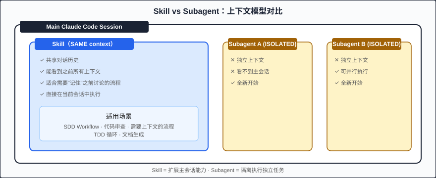

# Chapter 11: 技能系统：工作流封装 (Skills: Workflow Packaging)

> Skills 是可复用的工作流包，让 Claude Code 通过 slash command 执行预定义的多步骤流程，将专家经验固化为可重复调用的能力。

---

## 从 Ad-Hoc 到 Systematic

观察一下你和 Claude Code 的日常交互模式。每次开始一个新功能时，你是不是重复着类似的指令？

```
"先看一下 spec 文件..."
"根据 spec 生成实现计划..."
"按照计划逐个实现..."
"实现完后对照 spec 验证..."
```

这些步骤每次都一样，但你每次都要手动引导。更糟糕的是，不同团队成员可能用不同的方式引导，得到不同质量的结果。

**Skills（技能系统）** 解决了这个问题：它将一套经过验证的工作流封装为一个可复用的包，任何人都可以通过一个 slash command 触发完整的流程。

把它想象成这样的类比：

| 概念 | 编程类比 | 说明 |
|------|----------|------|
| 直接给 Claude 指令 | 内联代码 | 灵活但不可复用 |
| CLAUDE.md 中的规则 | 全局配置/常量 | 持久但被动 |
| **Skills** | **函数/方法** | 主动调用、可复用、封装了逻辑 |
| Subagents | 独立进程 | 隔离执行、无共享状态 |

---

## Skill 的解剖学

一个 Skill 本质上是一个 Markdown 文件（通常命名为 `SKILL.md` 或放在特定目录下），它定义了：

```markdown
# Skill: sdd-implement

## Description
从 Spec 文件出发，生成实现计划并逐步实现功能代码。

## Trigger
当用户输入 /sdd-implement 或要求 "按 spec 实现功能" 时激活。

## Inputs
- spec_path: Spec 文件的路径（必须）
- output_dir: 输出目录（可选，默认为 src/）

## Instructions

1. 读取 spec_path 指向的 Spec 文件
2. 提取所有 SHALL 约束作为验证清单
3. 生成分阶段的实现计划（Plan）
4. 按计划逐个实现，每个文件完成后对照 Spec 自检
5. 实现完毕后运行完整验证
6. 输出验证报告

## Constraints
- 每个文件不超过 400 行
- 必须遵循项目 CLAUDE.md 中的编码规范
- 所有公共 API 必须有 JSDoc 注释

## Output
- 实现的源代码文件
- verification-report.md（验证报告）
```

### 核心组成部分

| 部分 | 作用 | 类比 |
|------|------|------|
| **Name** | 唯一标识符 | 函数名 |
| **Description** | 何时使用、做什么 | 函数文档字符串 |
| **Trigger** | 激活条件 | 函数调用签名 |
| **Inputs** | 所需参数 | 函数参数列表 |
| **Instructions** | 步骤化的执行流程 | 函数体 |
| **Constraints** | 执行时的硬约束 | 断言/前置条件 |
| **Output** | 预期产出 | 返回值 |

---

## Skills vs Subagents：关键决策

这是一个常见的困惑点：什么时候用 Skill，什么时候用 Subagent（通过 Task tool 启动的独立代理）？

```
┌─────────────────────────────────────────────────────────┐
│               Main Claude Code Session                   │
│                                                          │
│  ┌─────────────────────────────────────────────┐        │
│  │  Skill Execution (SAME context)              │        │
│  │                                              │        │
│  │  - 共享对话历史                               │        │
│  │  - 能看到之前所有上下文                        │        │
│  │  - 适合需要"记住"之前讨论的流程               │        │
│  │  - 直接在当前会话中执行                        │        │
│  └─────────────────────────────────────────────┘        │
│                                                          │
│  ┌─────────────────────────┐  ┌────────────────────┐   │
│  │  Subagent A (ISOLATED)  │  │  Subagent B        │   │
│  │                         │  │  (ISOLATED)        │   │
│  │  - 独立上下文           │  │  - 独立上下文      │   │
│  │  - 看不到主会话历史     │  │  - 可并行执行      │   │
│  │  - 全新开始             │  │  - 全新开始        │   │
│  └─────────────────────────┘  └────────────────────┘   │
└─────────────────────────────────────────────────────────┘
```



### 决策矩阵

| 场景 | 选择 | 原因 |
|------|------|------|
| 多步骤工作流编排 | **Skill** | 需要步骤间的状态传递 |
| 独立的代码审查 | **Subagent** | 不需要看实现过程，隔离避免偏见 |
| Spec → Plan → Implement 流程 | **Skill** | 各阶段需要累积的上下文 |
| 并行的安全分析 + 性能分析 | **Subagent** | 独立任务，可并行 |
| 交互式的 Spec 编写引导 | **Skill** | 需要对话历史理解用户意图 |
| 格式化/验证某个文件 | **Subagent** | 简单独立任务 |

**简单记忆法**：

- Skill = 编排器（orchestrator），在主上下文中**指挥**流程
- Subagent = 工人（worker），在隔离环境中**执行**任务

---

## SDD 工作流 Skills 全家桶

将完整的 SDD 流程拆分为四个独立的 Skills，每个覆盖一个阶段：

### /sdd-specify — Spec 编写引导

```markdown
# Skill: sdd-specify

## Description
引导用户通过结构化问答编写符合 EARS（Easy Approach to Requirements Syntax）
规范的 Spec 文件。

## Trigger
/sdd-specify 或 "帮我写 spec"

## Inputs
- feature_name: 功能名称（必须）
- type: spec 类型 — feature | api | frontend（默认 feature）

## Instructions

### Phase 1: 需求采集
1. 询问用户：这个功能解决什么问题？目标用户是谁？
2. 询问核心场景：主要的 use case 是什么？
3. 询问边界：什么不在范围内？

### Phase 2: 约束提取
4. 将用户回答转化为 EARS 格式的 SHALL 语句
5. 区分 Functional Requirements 和 Non-Functional Requirements
6. 对每个约束赋予唯一 ID（如 FR-001, NFR-001）

### Phase 3: 结构化输出
7. 使用项目的 Spec 模板（templates/feature-spec-template.md）
8. 填充所有字段
9. 将草稿呈现给用户确认
10. 根据反馈迭代修改

### Phase 4: 验证
11. 检查：每个 SHALL 语句是否可测试？
12. 检查：是否有遗漏的 edge case？
13. 检查：是否有矛盾的约束？

## Constraints
- SHALL 语句必须可验证（measurable/testable）
- 不允许模糊词汇："尽量"、"合理"、"适当"
- 每个 Spec 不超过 50 个 SHALL 语句

## Output
- specs/{feature_name}.spec.md
```

### /sdd-plan — 实现计划生成

```markdown
# Skill: sdd-plan

## Description
从 Spec 文件生成分阶段的技术实现计划，包含文件结构、
依赖关系和验证点。

## Trigger
/sdd-plan 或 "生成实现计划"

## Inputs
- spec_path: Spec 文件路径（必须）

## Instructions

1. 读取并解析 Spec 文件中的所有 SHALL 约束
2. 分析约束之间的依赖关系（哪些必须先实现）
3. 规划文件结构：
   - 每个文件的职责
   - 文件间的依赖图
   - 接口/类型定义的位置
4. 生成分阶段计划：
   - Phase 1: 核心类型和接口定义
   - Phase 2: 基础设施（数据层、工具函数）
   - Phase 3: 业务逻辑实现
   - Phase 4: 集成与暴露的 API
5. 为每个文件标注：
   - 覆盖哪些 SHALL 约束（by ID）
   - 预估行数
   - 前置依赖

## Constraints
- 单个文件不超过 400 行
- 每个阶段可独立验证
- 必须标注所有 SHALL 约束的覆盖位置

## Output
- plans/{feature_name}.plan.md
```

### /sdd-tasks — 任务分解

```markdown
# Skill: sdd-tasks

## Description
将实现计划分解为可执行的原子任务列表，每个任务对应一个
可独立完成的工作单元。

## Trigger
/sdd-tasks 或 "分解为任务"

## Inputs
- plan_path: Plan 文件路径（必须）

## Instructions

1. 读取 Plan 文件
2. 将每个阶段的每个文件转化为一个 Task：
   - Task ID（如 T-001）
   - 描述（一句话）
   - 输入：依赖的文件/接口
   - 输出：要创建/修改的文件
   - 验证标准：如何确认 Task 完成
   - 阻塞关系：哪些 Task 必须先完成
3. 生成依赖图的文字表示
4. 标注可并行执行的 Task 组
5. 估算每个 Task 的 Token 预算

## Constraints
- 每个 Task 应可在单次 Claude 交互中完成
- Task 粒度：一个 Task = 一个文件 或 一个逻辑单元
- 必须是 DAG（有向无环图），不允许循环依赖

## Output
- plans/{feature_name}.tasks.md
```

### /sdd-verify — Spec 验证

```markdown
# Skill: sdd-verify

## Description
对照 Spec 文件验证实现代码是否满足所有 SHALL 约束，
生成合规性报告。

## Trigger
/sdd-verify 或 "验证实现"

## Inputs
- spec_path: Spec 文件路径（必须）
- source_dir: 源代码目录（默认 src/）

## Instructions

1. 读取 Spec 中的所有 SHALL 约束
2. 对每个约束：
   a. 定位对应的实现代码
   b. 判断是否满足（PASS / FAIL / PARTIAL）
   c. 如果 FAIL，说明差距
   d. 如果 PARTIAL，说明缺失部分
3. 计算合规率：PASS / total
4. 按严重程度排列 FAIL 项
5. 生成修复建议

## Constraints
- 不修改任何代码（只读验证）
- 必须给出具体的代码位置（文件:行号）
- FAIL 判定必须引用 Spec 条目 ID

## Output Format

```markdown
# Verification Report

## Summary
- Total constraints: 23
- PASS: 19 (82.6%)
- PARTIAL: 3 (13.0%)
- FAIL: 1 (4.3%)

## Failures

### FR-007: System SHALL validate email format
- Status: FAIL
- Location: src/validators/user.ts
- Issue: No email validation found in user creation flow
- Fix suggestion: Add zod email schema to CreateUserInput

## Partial

### NFR-002: Response time SHALL be under 200ms
- Status: PARTIAL
- Location: src/api/routes.ts:45
- Issue: No caching layer; DB queries may exceed 200ms under load
- Fix suggestion: Add Redis cache for frequent queries
```

## Constraints
- 合规率 < 80% 时标记为 BLOCKING
- 必须验证所有 SHALL 约束，不可跳过
```

---

## 将 Skill 注册到 Claude Code

Skills 可以通过多种方式注册：

### 方式 1：放在项目 `.claude/skills/` 目录

```
.claude/
├── settings.json
└── skills/
    ├── sdd-specify.md
    ├── sdd-plan.md
    ├── sdd-tasks.md
    └── sdd-verify.md
```

### 方式 2：在 CLAUDE.md 中引用

```markdown
## Available Skills

本项目支持以下 SDD Skills：

- `/sdd-specify` — 引导编写 Spec（详见 .claude/skills/sdd-specify.md）
- `/sdd-plan` — 从 Spec 生成 Plan
- `/sdd-tasks` — 从 Plan 分解 Tasks
- `/sdd-verify` — 验证实现是否合规
```

### 方式 3：全局 Skills（跨项目复用）

放在 `~/.claude/skills/` 中，所有项目都可使用。

---

## Meta-Deliverable：项目结束时生成 Skill

这是一个强大的元模式：**每个项目结束时，将学到的模式封装为一个新的 Skill**。

```markdown
# Post-Project Skill Generation

## When
项目完成、复盘完毕后。

## How
1. 回顾项目中重复出现的模式
2. 提取可泛化的工作流步骤
3. 编写 SKILL.md，将具体经验抽象为通用流程
4. 将 Skill 放入全局 ~/.claude/skills/ 供未来项目使用

## Example
- 做了 3 个 REST API 项目后 → 抽象出 /api-scaffold skill
- 做了数据迁移项目后 → 抽象出 /migration-plan skill
- 做了 monorepo 改造后 → 抽象出 /monorepo-split skill
```

这实现了 Claude Code 使用中的**持续学习**（Continuous Learning）— 不是 AI 自己学习，而是你通过 Skill 将经验编码化。

---

## 完整示例：SDD Workflow Skill

将整个 SDD 流程编排为单个 Skill：

```markdown
# Skill: sdd-workflow

## Description
执行完整的 SDD 工作流：从需求采集到验证通过。
这是一个编排型 Skill，会依次调用其他 SDD Skills。

## Trigger
/sdd-workflow 或 "完整 SDD 流程"

## Inputs
- feature_name: 功能名称（必须）
- skip_specify: 是否跳过 Spec 编写（如果已有 Spec，设为 true）

## Instructions

### Gate 0: Pre-check
- 确认 CLAUDE.md 存在
- 确认 templates/ 目录存在
- 确认项目可以构建（pnpm build 通过）

### Gate 1: Specify（如果 skip_specify != true）
- 执行 /sdd-specify 流程
- 产出 Spec 文件后请用户确认
- 用户确认后进入下一阶段

### Gate 2: Plan
- 执行 /sdd-plan 流程
- 展示计划概要给用户
- 用户确认后进入下一阶段

### Gate 3: Tasks
- 执行 /sdd-tasks 流程
- 展示任务列表和依赖图
- 用户确认后进入下一阶段

### Gate 4: Implement
- 按任务列表顺序实现
- 每完成一个 Task 运行该 Task 的验证标准
- 如果验证失败，修复后重新验证
- 所有 Tasks 完成后进入下一阶段

### Gate 5: Verify
- 执行 /sdd-verify 流程
- 如果合规率 < 100%，修复 FAIL 项
- 重复验证直到合规率 = 100%

### Gate 6: Finalize
- 运行完整测试套件
- 运行生产构建
- 生成 changelog 条目
- 提交建议（不自动 commit）

## Constraints
- 每个 Gate 之间必须有用户确认（除非指定 auto_approve）
- 单个 Task 实现超时（> 5 min）时暂停并询问用户
- 不自动推送到远程仓库

## Output
- Spec 文件、Plan 文件、Tasks 文件、源代码、验证报告
```

---

## Skill 设计原则

从实践中总结的 Skill 设计最佳实践：

### 1. 单一职责

一个 Skill 做一件事。如果你发现 Skill 超过 100 行 Instructions，考虑拆分。

### 2. Gate 模式

复杂 Skill 应包含多个 Gate（门控点），每个 Gate 之间可以暂停、确认、或回退。

### 3. 失败处理

明确定义失败时的行为：
- 继续下一步？
- 回退到上一步？
- 暂停等待人工干预？

### 4. 幂等性

重复执行 Skill 应产生相同结果（或至少不会破坏已有工作）。

### 5. 可观测性

Skill 执行过程中应输出进度信息，让用户知道当前在哪一步、还需要多久。

---

## 练习

### 练习 1：创建你的第一个 Skill

为你日常最频繁的工作流创建一个 Skill：
1. 观察你的 Claude Code 使用模式，找到重复出现的 3-5 步流程
2. 将其抽象为 SKILL.md 格式
3. 放入 `.claude/skills/` 目录
4. 通过 slash command 触发，验证它是否如预期工作

### 练习 2：构建 SDD Verify Skill

1. 创建一个简单的 Spec（3-5 个 SHALL 约束）
2. 故意写一个不完全合规的实现
3. 编写 `/sdd-verify` Skill
4. 执行验证，观察报告输出
5. 根据报告修复代码，重新验证至 100%

---

## Key Takeaways (要点回顾)

- **Skills 是封装的工作流**：将重复的多步骤流程固化为可复用的 slash command
- **Skills 在主上下文中执行**：与 Subagents 的隔离执行不同，Skills 共享对话历史
- **Gate 模式是 Skill 设计的核心**：复杂流程需要人工确认点和回退机制
- **Meta-Deliverable**：每个项目结束时产出新的 Skill，实现经验的编码化积累
- **SDD 全流程可 Skill 化**：Specify → Plan → Tasks → Implement → Verify 每一步都可以是独立的可调用 Skill

---

## Next (下一章)

[Chapter 12: 多代理编排模式 (Multi-Agent Orchestration Patterns)](12-multi-agent-patterns.md) — 当单个 Agent 不够用时，如何编排多个代理协作完成复杂任务，包括 Verifier 模式、并行研究、GAN 式生成-评估等实战模式。
