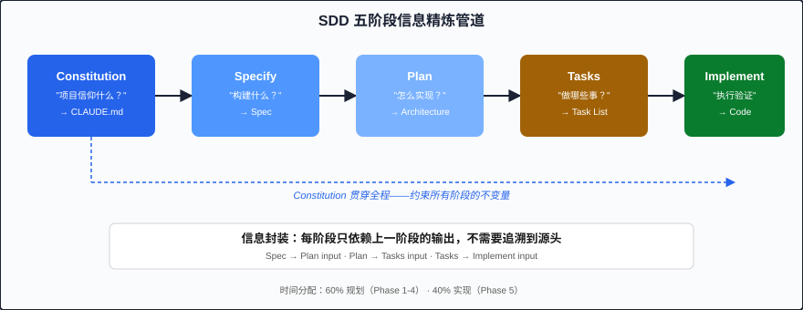

# Chapter 13: 核心五阶段流程 (The Five-Phase SDD Workflow)

> SDD 的核心是一条清晰的五阶段流水线：Constitution → Specify → Plan → Tasks → Implement，每阶段的输出严格喂给下一阶段的输入。

---

## 为什么需要固定流程？

在传统软件开发中，我们依赖团队成员的经验和默契来弥合"需求"与"代码"之间的鸿沟。但当 AI agent 成为执行者时，这种隐性知识（tacit knowledge）就不再可靠了——agent 只能根据显式的、结构化的指令行动。

SDD 的五阶段流程（Five-Phase Workflow）本质上是一套**信息精炼管道（information refinement pipeline）**：从最抽象的项目原则，逐步具象化为可执行的原子任务。每一阶段都在回答一个核心问题：

| 阶段 | 核心问题 | 产出物 |
|------|----------|--------|
| Constitution | "我们的项目信仰什么？" | CLAUDE.md |
| Specify | "我们在构建什么？" | Spec document |
| Plan | "技术上怎么实现？" | Architecture plan |
| Tasks | "具体做哪些事？" | Task list |
| Implement | "执行并验证" | Working code |

---

## 流程全景图

```
┌─────────────────────────────────────────────────────────────┐
│                    SDD Five-Phase Flow                        │
├─────────────────────────────────────────────────────────────┤
│                                                              │
│  ┌──────────┐    ┌─────────┐    ┌──────┐    ┌───────┐      │
│  │Constitution│──▶│ Specify │──▶│ Plan │──▶│ Tasks │──┐   │
│  └──────────┘    └─────────┘    └──────┘    └───────┘  │   │
│       │                                          │      │   │
│       │         ┌───────────┐                    │      │   │
│       └────────▶│ Implement │◀───────────────────┘      │   │
│                 └─────┬─────┘                           │   │
│                       │                                  │   │
│                       ▼                                  │   │
│                 ┌───────────┐                            │   │
│                 │  Working  │                            │   │
│                 │   Code    │                            │   │
│                 └───────────┘                            │   │
│                                                          │   │
└─────────────────────────────────────────────────────────────┘

信息流方向：
Constitution ─────▶ 全程可见，约束所有阶段
Specify output ───▶ Plan input
Plan output ──────▶ Tasks input
Tasks output ─────▶ Implement input
```



注意 Constitution 的箭头指向所有后续阶段——它不仅仅是 Specify 的前置条件，而是贯穿全流程的**不变量（invariant）**。

---

## Phase 1: Constitution（宪法）

### 回答的问题

"这个项目的不可协商原则是什么？"

### 什么是 Constitution？

Constitution 是你的项目 CLAUDE.md 文件中的**永久性规则**。它类似于一个国家的宪法——不因某次选举（feature request）而改变，只在极少数情况下修正。

### 应该包含什么

```markdown
# Project Constitution (CLAUDE.md)

## Tech Stack
- Runtime: Node.js 20 LTS
- Framework: Express.js with TypeScript
- Database: PostgreSQL 16 with Prisma ORM
- Testing: Vitest + Playwright

## Architecture Style
- Layered architecture: Router → Controller → Service → Repository
- All business logic lives in Service layer
- Controllers handle HTTP concerns only

## Security Rules
- All user inputs validated with Zod schemas
- SQL via Prisma only (no raw queries except migrations)
- JWT tokens expire in 15 minutes, refresh tokens in 7 days
- No secrets in source code; use environment variables

## Coding Standards
- Immutable data patterns preferred
- Functions < 50 lines, files < 400 lines
- All public APIs must have JSDoc comments
- Error handling: never swallow errors silently
```

### 不应该包含什么

- 特定 feature 的实现细节（那属于 Plan 阶段）
- 临时性决策（"本周先用 mock data"——这种写在 task 里）
- 过于冗长的说明（超过 200 行应拆分为 subagent skills）

### Claude Code 实践

```bash
# 创建项目宪法
claude "Read the existing codebase and draft a CLAUDE.md 
capturing our tech stack, architecture patterns, and coding conventions."

# 验证宪法质量
claude "Review CLAUDE.md for completeness. Does it cover: 
tech stack, architecture style, security rules, coding standards, 
and testing requirements?"
```

**Template reference**: 详见 [templates/constitution-template.md](../templates/constitution-template.md)

---

## Phase 2: Specify（规格）

### 回答的问题

"我们在构建什么？（以及，什么是我们明确不构建的？）"

### EARS Notation 驱动的需求

SDD 使用 EARS（Easy Approach to Requirements Syntax）来消除需求歧义：

| EARS 类型 | 模板 | 示例 |
|-----------|------|------|
| Ubiquitous | The system shall [action] | 系统应对所有密码进行 bcrypt hash |
| Event-Driven | When [event], the system shall [action] | 当用户提交注册表单时，系统应创建账户 |
| State-Driven | While [state], the system shall [action] | 当用户已登录时，系统应显示 dashboard |
| Unwanted | If [condition], the system shall [action] | 若邮箱已注册，系统应返回 409 Conflict |
| Optional | Where [feature], the system shall [action] | 若启用 2FA，系统应发送验证码 |

### Acceptance Criteria 的黄金标准

每条 acceptance criteria 必须是**可测试的（testable）**——意味着你能写出一个自动化测试来验证它：

```markdown
## Acceptance Criteria

- [ ] POST /api/auth/register returns 201 with user ID when valid input provided
- [ ] Password is stored as bcrypt hash with cost factor 12
- [ ] Duplicate email returns 409 with error message "Email already registered"
- [ ] Username must be 3-30 characters, alphanumeric + underscore only
- [ ] Registration event published to event bus within 500ms
```

### 显式声明 Out-of-Scope

```markdown
## Out of Scope (本次不做)

- Social login (OAuth) — planned for Sprint 4
- Email verification flow — separate spec
- Profile photo upload — separate spec
- Password strength meter UI — frontend spec
```

这不是可选项。**明确的 out-of-scope 声明是防止 AI agent scope creep 的唯一可靠手段。**

**Template reference**: 详见 [templates/spec-template.md](../templates/spec-template.md)

---

## Phase 3: Plan（计划）

### 回答的问题

"在技术层面，我们如何实现这个 spec？"

### Architecture Decisions

每个重要决策都需要 rationale（理由）：

```markdown
## Architecture Decisions

### AD-01: Separate auth service from main API
- **Decision**: Auth endpoints live in a dedicated router module
- **Rationale**: Auth logic changes independently; isolating it enables 
  future extraction to microservice without refactoring
- **Alternatives considered**: Inline in user controller (rejected: coupling)

### AD-02: Event-driven notification
- **Decision**: Use in-process event emitter (not message queue)
- **Rationale**: Current scale doesn't justify MQ complexity; 
  event interface allows future swap without code changes
```

### Component/Module 分解

```markdown
## Module Breakdown

src/
├── modules/
│   └── auth/
│       ├── auth.router.ts      # HTTP routing
│       ├── auth.controller.ts  # Request/response handling
│       ├── auth.service.ts     # Business logic
│       ├── auth.repository.ts  # Data access
│       ├── auth.schema.ts      # Zod validation schemas
│       └── auth.types.ts       # TypeScript interfaces
├── shared/
│   ├── middleware/
│   │   └── validate.ts         # Schema validation middleware
│   └── events/
│       └── event-bus.ts        # In-process event emitter
└── prisma/
    └── migrations/             # Database migrations
```

### Data Model

```markdown
## Data Model

### User Table
| Column | Type | Constraints |
|--------|------|-------------|
| id | UUID | PK, default gen_random_uuid() |
| email | VARCHAR(255) | UNIQUE, NOT NULL |
| username | VARCHAR(30) | UNIQUE, NOT NULL |
| password_hash | VARCHAR(60) | NOT NULL |
| created_at | TIMESTAMPTZ | NOT NULL, default now() |
| updated_at | TIMESTAMPTZ | NOT NULL, default now() |
```

**Template reference**: 详见 [templates/plan-template.md](../templates/plan-template.md)

---

## Phase 4: Tasks（任务）

### 回答的问题

"我要按什么顺序做哪些具体的事？"

### 任务分解原则

Tasks 是 **atomic execution units（原子执行单元）**——每个 task 应该是 agent 能在单次会话中完成的独立工作。

**排序铁律：**
```
Infrastructure → Data Model → Tests → Implementation → Integration
```

这个顺序不是建议，而是规则。原因：
- Infrastructure 是所有后续工作的基础
- Data model 决定了 API shape
- Tests 先写是 TDD 的核心（详见 [Chapter 15](./15-tdd-integration.md)）
- Implementation 在有测试守护下更安全
- Integration 在所有组件就绪后才有意义

### Task 格式

```markdown
## Task List

### Task 1: Database migration for User table
- **Spec ref**: AC-01 (user registration creates account)
- **Action**: Create Prisma migration with User model
- **Acceptance**: Migration runs successfully, table created in dev DB
- **Dependencies**: None (infrastructure task)

### Task 2: Write registration validation tests
- **Spec ref**: AC-04 (username validation rules)
- **Action**: Create auth.schema.test.ts with validation cases
- **Acceptance**: Tests exist and FAIL (no implementation yet)
- **Dependencies**: Task 1

### Task 3: Implement Zod validation schema
- **Spec ref**: AC-04
- **Action**: Create auth.schema.ts with registerSchema
- **Acceptance**: Task 2 tests pass
- **Dependencies**: Task 2

### Task 4: Write registration service tests
- **Spec ref**: AC-01, AC-02, AC-03
- **Action**: Create auth.service.test.ts
- **Acceptance**: Tests exist and FAIL
- **Dependencies**: Task 1

### Task 5: Implement registration service
- **Spec ref**: AC-01, AC-02, AC-03
- **Action**: Create auth.service.ts with register method
- **Acceptance**: Task 4 tests pass
- **Dependencies**: Task 3, Task 4
```

每个 task 都引用了它对应的 spec requirement（**Spec ref** 字段），这就是 SDD 的**可追溯性（traceability）**。

**Template reference**: 详见 [templates/task-template.md](../templates/task-template.md)

---

## Phase 5: Implement（实现）

### 回答的问题

"执行 task，验证结果，标记完成。"

### 执行纪律

Implementation 阶段的规则很简单：

1. **一次一个 task**：不要并行处理多个 task（agent context 有限）
2. **完成即标记**：task 完成后立即标记 `[x]`，不要积压
3. **每个 task 一次 commit**：原子性 commit 便于 review 和回滚
4. **Verifier 检查**：实现完成后用 verifier subagent 验证

### Claude Code 实践

```bash
# 执行单个 task
claude "Execute Task 3 from the task list. 
Implement the Zod validation schema in auth.schema.ts. 
Run the existing tests in auth.schema.test.ts to verify."

# Verifier 检查
claude "Act as a verifier. Check that Task 3 implementation:
1. Satisfies spec AC-04 (username 3-30 chars, alphanumeric + underscore)
2. All tests in auth.schema.test.ts pass
3. Code follows CLAUDE.md conventions"
```

### Commit 策略

```bash
# 每完成一个 task
git add src/modules/auth/auth.schema.ts
git commit -m "feat(auth): implement registration validation schema

Implements Zod schema for registration input validation.
- Username: 3-30 chars, alphanumeric + underscore
- Email: valid email format
- Password: minimum 8 chars

Spec ref: AC-04
Task: 3/12"
```

---

## 信息流：每阶段如何喂给下一阶段

```
Constitution (CLAUDE.md)
    │
    │ "遵守这些不可变规则"
    ▼
Specify (spec.md)
    │
    │ "实现这些需求和验收标准"
    ▼
Plan (plan.md)
    │
    │ "按这个架构和模块划分实现"
    ▼
Tasks (tasks.md)
    │
    │ "按这个顺序执行这些原子操作"
    ▼
Implement (code + tests)
    │
    │ "验证结果符合 spec"
    ▼
Done ✓
```

关键洞察：**每一阶段的产出物都是下一阶段的唯一输入**。Plan 不需要回去重读原始用户需求——它只需要读 Spec。Tasks 不需要理解为什么选择 PostgreSQL——它只需要知道 Plan 里说了用 PostgreSQL。

这种**信息封装（information encapsulation）**让每个阶段的 AI agent 都能在有限的 context window 中高效工作。

---

## 60/40 时间分配原则

SDD 最反直觉的建议是：**花 60% 的时间在 Phase 1-4（规划），40% 在 Phase 5（实现）**。

```
传统开发时间分配：
[██░░░░░░░░░░░░░░░░░░] 10% 规划
[████████████████████] 90% 编码 + 调试

SDD 时间分配：
[████████████░░░░░░░░] 60% Constitution + Specify + Plan + Tasks
[████████░░░░░░░░░░░░] 40% Implement
```

为什么这样更快？

1. **前期精度降低后期返工**：一个 Spec 阶段发现的歧义，在 Implementation 阶段可能要花 10 倍时间修复
2. **AI agent 执行速度极快**：当指令清晰时，agent 可以在几分钟内完成一个 task
3. **Phase gates 阻止垃圾累积**：每个阶段门（详见 [Chapter 14](./14-phase-gates.md)）都在拦截错误向下传播

---

## 实战示例：用户注册功能

让我们快速走一遍五阶段，为一个"用户注册"功能：

### Phase 1: Constitution
```
Already defined: Node.js + Express + TypeScript + PostgreSQL + Prisma + Vitest.
Auth rules: bcrypt with cost 12, JWT 15min expiry. Layered architecture.
```

### Phase 2: Specify
```
EARS: "When a user submits valid registration data, the system shall create 
an account and return 201 with user ID."
AC: 5 testable criteria covering happy path, validation, and conflict cases.
Out-of-scope: OAuth, email verification, profile photos.
```

### Phase 3: Plan
```
Module: src/modules/auth/ with router/controller/service/repository layers.
Data model: User table with id, email, username, password_hash, timestamps.
Decision: In-process events over message queue (scale not yet justified).
```

### Phase 4: Tasks
```
12 tasks ordered: migration → test schemas → implement schemas → 
test service → implement service → test controller → implement controller → 
test router → implement router → integration test → event publishing → docs.
```

### Phase 5: Implement
```
Agent executes tasks 1-12 sequentially. Each task: code → test → commit.
Verifier confirms all AC met. Total: 12 atomic commits, full test coverage.
```

---

## Key Takeaways (要点回顾)

1. **五阶段是信息精炼管道**：从抽象原则到可执行代码，每阶段回答一个核心问题
2. **Constitution 贯穿全程**：它不是一次性输入，而是所有阶段的持续约束
3. **信息封装是关键设计**：每阶段只依赖上一阶段的输出，不需要追溯到源头
4. **60/40 时间分配**：规划占 60%，实现占 40%——前期投入换来后期速度
5. **可追溯性**：从 task 到 spec、从 spec 到 acceptance criteria，每个决策都能追溯到源头

---

## Next (下一章)

[Chapter 14: 阶段门：质量关卡 (Phase Gates: Quality Checkpoints)](./14-phase-gates.md) — 学习如何在阶段之间设置质量检查点，确保错误在传播之前被拦截。
