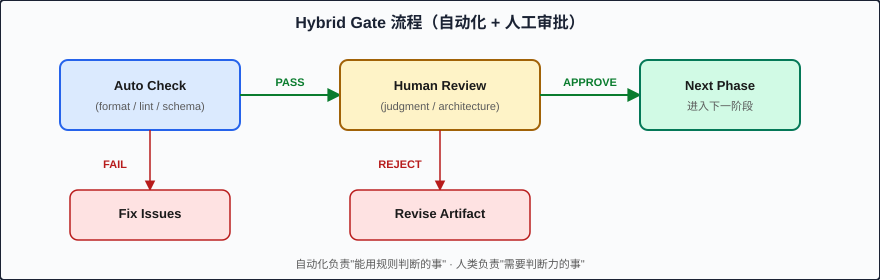

# Chapter 14: 阶段门：质量关卡 (Phase Gates: Quality Checkpoints)

> 阶段门是 SDD 五阶段之间的结构化审查点——每一道门都在问："上一阶段的产出物是否足够好，可以进入下一阶段？"

---

## 什么是 Phase Gates？

在制造业中，"quality gate（质量门）"是产品从一个生产阶段进入下一阶段前必须通过的检查点。产品不达标就不能继续——修好再来。

SDD 借用了这个概念。**Phase gate** 是两个相邻阶段之间的审查机制：

```
Constitution ──┤Gate 0├── Specify ──┤Gate 1├── Plan ──┤Gate 2├── Tasks ──┤Gate 3├── Implement ──┤Gate 4├── Done
```

每道门的职责是单一的：**验证上一阶段的产出物是否满足进入下一阶段的最低质量标准**。

---

## 为什么 Phase Gates 重要？

### 10x 成本规则

软件工程的一条经验法则：**缺陷在每个后续阶段的修复成本增长约 10 倍**。

```
阶段         │ 发现缺陷的修复成本
─────────────┼─────────────────────
Specify      │ $1    (修改一行 spec)
Plan         │ $10   (重新设计一个组件)
Tasks        │ $100  (重新排列任务依赖)
Implement    │ $1000 (重写代码 + 重新测试)
Production   │ $10000 (修复 + 回滚 + 用户影响)
```

Phase gates 的价值在于：**让你在 $1 的阶段发现 $1000 的问题**。

### "审批计数"优势

没有 phase gates 时，code review 要面对数十个微决策："为什么用这个库？""这个字段为什么是 nullable？""为什么不做 pagination？"

有了 phase gates，reviewer 只需审批 3-4 个文档：
1. Spec document（一次审批需求完整性）
2. Plan document（一次审批架构合理性）
3. Task list（一次审批执行顺序）
4. Final code（验证实现符合以上三者）

这比审查 50 个散乱的 PR comment 高效得多。

---

## Gate 类型

### 1. Manual Approval（人工审核）

人类读取产出物，判断是否可以继续。

```markdown
## Gate 1 Review: Specify → Plan

Reviewer: @tech-lead
Status: ✅ APPROVED / ❌ CHANGES REQUESTED

Checklist:
- [x] All requirements use EARS notation
- [x] Acceptance criteria are testable (have concrete values)
- [x] Out-of-scope section exists and is explicit
- [x] No contradictions between requirements
- [ ] Edge cases for input validation not specified  ← CHANGES REQUESTED
```

**适用场景**：高风险功能、安全相关变更、架构决策。

### 2. Automated Validation（自动化验证）

脚本或 hook 自动检查产出物格式和内容。

```bash
# 自动化验证 spec 格式
claude "Validate this spec document against our EARS template:
1. Does every requirement use EARS notation (When/While/If/Where)?
2. Does every AC have a concrete testable value?
3. Is there an explicit out-of-scope section?
4. Are there any ambiguous words (should, might, could, possibly)?
Report: PASS or FAIL with specific issues."
```

**适用场景**：格式检查、模板合规性、自动化可以判断的规则。

### 3. Hybrid（混合）

自动化先做 pre-check，通过后再交给人工做最终审批。

```
┌──────────┐     PASS     ┌──────────────┐     APPROVE     ┌──────┐
│Auto Check│────────────▶│Human Review  │──────────────▶│Next  │
│(format)  │             │(judgment)    │               │Phase │
└──────────┘             └──────────────┘               └──────┘
      │                         │
      │ FAIL                    │ REJECT
      ▼                         ▼
┌──────────┐             ┌──────────────┐
│Fix Issues│             │Revise Artifact│
└──────────┘             └──────────────┘
```



**适用场景**：大多数实际项目。自动化负责"能用规则判断的事"，人类负责"需要判断力的事"。

---

## 逐门审查标准

### Gate 1: Specify → Plan

**准入条件**：Spec 是否足够清晰，让架构师能设计解决方案？

| 检查项 | Pass 标准 | Red Flag |
|--------|-----------|----------|
| EARS 格式 | 所有需求使用 EARS 模板 | 存在 "The system should maybe..." |
| 可测试性 | 每个 AC 有具体值 | "Response should be fast" (多快？) |
| 范围边界 | Out-of-scope 明确列出 | 没有 out-of-scope 部分 |
| 无歧义 | 无 "should/might/could" | 模糊限定词超过 2 个 |
| 完整性 | 覆盖 happy path + error cases | 只有 happy path |

```bash
# Claude Code: Gate 1 自动化检查
claude "You are a spec reviewer. Check this spec against Gate 1 criteria:
1. All requirements use EARS notation?
2. All acceptance criteria have concrete testable values?
3. Out-of-scope section is present and non-empty?
4. No ambiguous words (should, might, could, possibly, ideally)?
5. Error cases and edge cases covered?
Output: PASS/FAIL with itemized results."
```

### Gate 2: Plan → Tasks

**准入条件**：架构设计是否完整到足以分解为具体任务？

| 检查项 | Pass 标准 | Red Flag |
|--------|-----------|----------|
| 需求覆盖 | 每个 spec requirement 有对应模块 | Spec 中有需求在 plan 中找不到 |
| 风险识别 | 已知风险列出并有缓解策略 | "没有风险"（这本身就是风险） |
| Tech stack 合理 | 选型有 rationale | "因为流行所以用" |
| 模块职责清晰 | 每个模块单一职责 | 一个模块承担 5 种功能 |
| Data model 完整 | 所有实体和关系定义好 | 字段类型或约束缺失 |

```bash
# Claude Code: Gate 2 交叉验证
claude "Cross-reference the plan against the spec:
1. For each spec requirement, identify which plan module addresses it
2. Flag any spec requirement with no corresponding plan module
3. Flag any plan module with no corresponding spec requirement (scope creep)
4. Verify data model supports all acceptance criteria
Output as a traceability matrix."
```

### Gate 3: Tasks → Implement

**准入条件**：任务列表是否足够原子化和有序，让 agent 能逐个执行？

| 检查项 | Pass 标准 | Red Flag |
|--------|-----------|----------|
| 原子性 | 每个 task 可在一次 session 完成 | Task 描述含 "...and also..." |
| 顺序正确 | Infrastructure → Data → Tests → Code | 代码 task 在测试 task 前面 |
| 依赖显式 | Dependencies 字段填写 | 依赖关系不清楚 |
| Spec 引用 | 每个 task 有 Spec ref | 无法追溯 task 到需求 |
| TDD 就位 | 测试 task 先于实现 task | 只有实现，没有测试 |

```bash
# Claude Code: Gate 3 验证
claude "Validate task list against Gate 3 criteria:
1. Is each task completable in a single session (< 100 lines of code)?
2. Are test tasks ordered BEFORE implementation tasks?
3. Does every task have a 'Spec ref' field?
4. Are dependencies between tasks explicit and acyclic?
5. Does the ordering follow: infrastructure → data → tests → implementation?
Output: PASS/FAIL with specific violations."
```

### Gate 4: Implement → Done

**准入条件**：实现是否满足 spec 中所有 acceptance criteria？

| 检查项 | Pass 标准 | Red Flag |
|--------|-----------|----------|
| 测试通过 | 所有测试 pass | 任何 test failure |
| 覆盖率 | >= 80% | 覆盖率 < 80% |
| Spec 合规 | 所有 AC 都有对应测试 | AC 没有自动化验证 |
| Verifier 通过 | Verifier agent 确认 | Verifier 报告偏差 |
| 文档更新 | API docs 已同步 | 新 endpoint 无文档 |
| Build 成功 | Production build passes | Build 失败 |

```bash
# Claude Code: Gate 4 完整验证
claude "Act as a verifier agent. Perform final gate check:
1. Run all tests — report pass/fail count
2. Check test coverage — must be >= 80%
3. Cross-reference each spec AC against test suite
4. Verify no TODO/FIXME/HACK comments in new code
5. Verify CLAUDE.md conventions are followed
6. Run production build
Output: APPROVED or BLOCKED with specific issues."
```

---

## 使用 Claude Code Hooks 自动化

### PreToolUse Hook: 验证 Task 格式

在 agent 开始执行 task 之前，验证 task 格式是否合规：

```json
{
  "hooks": {
    "PreToolUse": [
      {
        "matcher": "Write|Edit",
        "command": "node -e \"let d='';process.stdin.on('data',c=>d+=c);process.stdin.on('end',()=>{const i=JSON.parse(d);const f=i.tool_input?.file_path||'';if(f.includes('tasks')&&!f.endsWith('.test.')){const c=i.tool_input?.content||'';if(!c.includes('Spec ref')){console.error('[Gate] BLOCKED: Task file missing Spec ref field');process.exit(2)}}console.log(d)})\"",
        "description": "Ensure task files include Spec ref traceability"
      }
    ]
  }
}
```

### PostToolUse Hook: 代码变更后运行测试

```json
{
  "hooks": {
    "PostToolUse": [
      {
        "matcher": "Write|Edit",
        "command": "pnpm vitest run --reporter=verbose 2>&1 | tail -20",
        "description": "Run tests after code changes to catch regressions"
      }
    ]
  }
}
```

### Stop Hook: 最终构建验证

```json
{
  "hooks": {
    "Stop": [
      {
        "command": "pnpm build && pnpm test:coverage -- --reporter=json | node -e \"let d='';process.stdin.on('data',c=>d+=c);process.stdin.on('end',()=>{const r=JSON.parse(d);const cov=r.total?.lines?.pct||0;if(cov<80){console.error('[Gate 4] Coverage '+cov+'% < 80% minimum');process.exit(1)}console.log('[Gate 4] PASS: Coverage '+cov+'%')})\"",
        "description": "Final gate: build + coverage check before session ends"
      }
    ]
  }
}
```

---

## Red Flags: 每道门的阻止信号

### Gate 1 阻止信号（Spec 质量）
- 使用"应该尽量..."等模糊表述
- Acceptance criteria 中有主观判断（"界面美观"）
- 缺少错误处理场景
- 需求之间有逻辑矛盾

### Gate 2 阻止信号（Plan 质量）
- 技术选型没有 rationale
- 存在 spec requirement 没有对应的模块
- Data model 不支持某些 AC
- 没有考虑非功能需求（性能、安全）

### Gate 3 阻止信号（Task 质量）
- 单个 task 包含多个不相关操作
- 实现 task 排在测试 task 前面
- 存在循环依赖
- Task 描述过于模糊（"实现注册功能"——这不是原子操作）

### Gate 4 阻止信号（Implementation 质量）
- 任何测试失败
- 覆盖率低于 80%
- 存在 spec AC 没有对应测试
- Production build 失败
- 存在硬编码密钥或调试代码

---

## 何时跳过 Gates？

Phase gates 不是教条。以下场景可以简化或跳过：

| 场景 | 可简化/跳过 | 理由 |
|------|-------------|------|
| 一行 bug fix | 跳过 Gate 1-3，保留 Gate 4 | 改动范围极小，测试验证就够 |
| 紧急热修复（hotfix） | 简化所有 gates 为快速 checklist | 速度优先，事后补文档 |
| 熟悉的重复模式 | 简化 Gate 2 | 架构已验证过 |
| 纯文档更新 | 跳过 Gate 3-4 | 无代码变更 |
| 原型/探索（prototype） | 跳过所有 gates | 代码是一次性的 |

**关键原则**：gate 的严格程度应与变更的风险等级成正比。

```
风险评估公式：
Risk = Impact × Probability × Reversibility

- 高风险 (支付系统变更): 所有 gates 全部通过
- 中风险 (新 API endpoint): Gate 1 + Gate 3 + Gate 4
- 低风险 (UI 文案修改): Gate 4 only (测试通过即可)
```

---

## 实战示例：Gate 2 审查

假设我们在做用户注册功能，Plan 文档已完成。Gate 2 审查如下：

```markdown
## Gate 2 Review: Plan → Tasks

### Traceability Matrix

| Spec Requirement | Plan Module | Status |
|-----------------|-------------|--------|
| AC-01: Create account on valid input | auth.service.register() | ✅ Covered |
| AC-02: bcrypt hash with cost 12 | auth.service.hashPassword() | ✅ Covered |
| AC-03: 409 on duplicate email | auth.repository.findByEmail() | ✅ Covered |
| AC-04: Username validation | auth.schema.registerSchema | ✅ Covered |
| AC-05: Event publish within 500ms | event-bus.emit('user.registered') | ✅ Covered |

### Risk Assessment
- Risk 1: bcrypt cost 12 may be slow on CI → Mitigation: use lower cost in test env
- Risk 2: Event timing requirement (500ms) hard to test → Mitigation: integration test with timing assertion

### Verdict: ✅ APPROVED — Proceed to Tasks phase
```

---

## 与团队协作集成

### Solo 开发者

- Gate 1-3: 自我审查 + AI verifier agent
- Gate 4: 自动化测试 + AI verifier

### 小团队 (2-5人)

- Gate 1: 产品负责人审批 spec
- Gate 2: 技术负责人审批 plan
- Gate 3: 同事快速 review task list
- Gate 4: CI/CD 自动化 + code review

### 大团队

- Gate 1-2: 正式 review meeting 或 async PR-style review
- Gate 3-4: 自动化为主，人工抽查

---

## Key Takeaways (要点回顾)

1. **Phase gates 是错误的早期拦截器**：在 $1 阶段发现 $1000 的问题
2. **三种 gate 类型适配不同场景**：Manual、Automated、Hybrid，按风险级别选择
3. **每道门有明确的检查清单**：不是主观判断，而是可验证的标准
4. **Gate 严格度与风险成正比**：高风险变更全部通过，低风险变更只需 Gate 4
5. **自动化 gates 通过 hooks 实现**：PreToolUse 验证格式，PostToolUse 运行测试，Stop 做最终检查

---

## Next (下一章)

[Chapter 15: SDD + TDD 协同 (Integrating SDD with TDD)](./15-tdd-integration.md) — 学习 SDD 的外循环如何与 TDD 的内循环协同工作，让每个 task 都在测试守护下执行。
