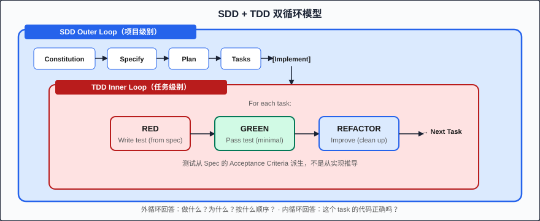

# Chapter 15: SDD + TDD 协同 (Integrating SDD with TDD)

> SDD 提供外循环（从需求到任务），TDD 提供内循环（从测试到代码）。两者结合，形成一个双层验证系统：spec 保证"做对的事"，测试保证"把事做对"。

---

## 双循环模型 (The Dual-Loop Model)

SDD 和 TDD 不是竞争关系——它们在不同粒度上解决不同问题：

```
┌─────────────────────────────────────────────────────────────────┐
│ SDD Outer Loop (项目级别)                                        │
│                                                                  │
│  Constitution → Specify → Plan → Tasks → [Implement]            │
│                                              │                   │
│                                              ▼                   │
│  ┌─────────────────────────────────────────────────────────┐    │
│  │ TDD Inner Loop (任务级别)                                │    │
│  │                                                          │    │
│  │  For each task:                                          │    │
│  │    ┌─────┐     ┌───────┐     ┌──────────┐              │    │
│  │    │ RED │────▶│ GREEN │────▶│ REFACTOR │──▶ Next Task  │    │
│  │    └─────┘     └───────┘     └──────────┘              │    │
│  │    Write test   Pass test    Improve code               │    │
│  │    (from spec)  (minimal)    (clean up)                 │    │
│  │                                                          │    │
│  └─────────────────────────────────────────────────────────┘    │
│                                                                  │
└─────────────────────────────────────────────────────────────────┘
```



**外循环（SDD）**回答：我们在做什么？为什么？按什么顺序？
**内循环（TDD）**回答：这个具体 task 的代码正确吗？

两个循环的接口点是 **Tasks 阶段**——每个 task 都同时是 SDD 的原子执行单元和 TDD 的一个 RED-GREEN-REFACTOR 周期。

---

## 从 EARS 到 Test Cases

EARS notation 不仅仅是一种需求写法——它直接映射到测试类型。这是 SDD+TDD 协同的核心机制：

### Ubiquitous Requirement → Unit Test

**特征**：无条件，系统始终应满足。

```markdown
# Spec (EARS)
"The system shall hash all passwords with bcrypt cost factor 12."
```

```typescript
// Test: 始终为真的不变量
describe('password hashing', () => {
  test('always uses bcrypt with cost factor 12', () => {
    // Arrange
    const plainPassword = 'SecureP@ss123';
    
    // Act
    const hash = hashPassword(plainPassword);
    
    // Assert
    expect(hash).toMatch(/^\$2[aby]\$12\$/); // bcrypt cost 12 prefix
  });

  test('never stores plaintext password', () => {
    const plainPassword = 'SecureP@ss123';
    const hash = hashPassword(plainPassword);
    expect(hash).not.toContain(plainPassword);
  });
});
```

### Event-Driven Requirement → Integration Test

**特征**：当某事件发生时，系统应执行某操作。

```markdown
# Spec (EARS)
"When a user submits valid registration data, the system shall create 
an account and return 201 with user ID."
```

```typescript
// Test: 触发事件，验证结果
describe('POST /api/auth/register', () => {
  test('when valid data submitted, creates account and returns 201', async () => {
    // Arrange
    const validInput = {
      email: 'new@example.com',
      username: 'newuser',
      password: 'SecureP@ss123'
    };

    // Act
    const response = await request(app)
      .post('/api/auth/register')
      .send(validInput);

    // Assert
    expect(response.status).toBe(201);
    expect(response.body).toHaveProperty('id');
    expect(response.body.id).toMatch(/^[0-9a-f-]{36}$/); // UUID format
  });
});
```

### State-Driven Requirement → State Machine Test

**特征**：当系统处于某状态时，应表现出某行为。

```markdown
# Spec (EARS)
"While a user is authenticated, the system shall include user ID 
in the request context for all protected endpoints."
```

```typescript
// Test: 在特定状态下验证行为
describe('authenticated state behavior', () => {
  test('while authenticated, request context includes user ID', async () => {
    // Arrange: put system in authenticated state
    const token = await authenticateUser('test@example.com', 'password');
    
    // Act: access protected endpoint while in authenticated state
    const response = await request(app)
      .get('/api/profile')
      .set('Authorization', `Bearer ${token}`);

    // Assert: behavior matches state-driven requirement
    expect(response.status).toBe(200);
    expect(response.body.userId).toBeDefined();
  });

  test('while NOT authenticated, protected endpoints return 401', async () => {
    // Arrange: no token (unauthenticated state)
    
    // Act
    const response = await request(app).get('/api/profile');

    // Assert
    expect(response.status).toBe(401);
  });
});
```

### Unwanted Requirement → Negative Test

**特征**：当不期望的情况发生时，系统应如何处理。

```markdown
# Spec (EARS)
"If the email is already registered, the system shall return 409 Conflict 
with message 'Email already registered'."
```

```typescript
// Test: 不良输入/状态，验证错误处理
describe('registration error handling', () => {
  test('if email already registered, returns 409 with error message', async () => {
    // Arrange: create existing user
    await createUser({ email: 'existing@example.com', username: 'existing' });

    // Act: attempt to register with same email
    const response = await request(app)
      .post('/api/auth/register')
      .send({
        email: 'existing@example.com',
        username: 'different',
        password: 'SecureP@ss123'
      });

    // Assert
    expect(response.status).toBe(409);
    expect(response.body.error).toBe('Email already registered');
  });

  test('if username too short, returns 400 with validation error', async () => {
    const response = await request(app)
      .post('/api/auth/register')
      .send({
        email: 'new@example.com',
        username: 'ab', // too short (min 3)
        password: 'SecureP@ss123'
      });

    expect(response.status).toBe(400);
    expect(response.body.error).toContain('username');
  });
});
```

### 映射速查表

| EARS 类型 | 测试类型 | 测试关注点 |
|-----------|----------|-----------|
| Ubiquitous | Unit test | 不变量，始终为真 |
| Event-Driven | Integration test | 触发 → 响应 |
| State-Driven | State machine test | 状态 → 行为 |
| Unwanted | Negative test | 异常 → 错误处理 |
| Optional | Feature flag test | 配置开启时的行为 |

---

## Spec-Test-Code 三位一体 (The Triad)

SDD+TDD 的核心哲学可以用一个三角形表示：

```
          SPEC
         (定义 WHAT)
        /          \
       /    ALIGN    \
      /     三者      \
     /     必须       \
    /      对齐        \
   /                    \
  TEST ──────────── CODE
  (验证 WHAT)      (实现 WHAT)
```

**三条规则：**

1. **Spec 定义 WHAT**：需求描述期望行为
2. **Test 验证 WHAT**：测试验证行为是否正确
3. **Code 实现 WHAT**：代码产生期望行为

**当三者发生冲突时：Spec 赢。**

这意味着：
- 如果 test 通过但 spec 被违反 → test 有缺陷，修复 test
- 如果 code 通过 test 但不符合 spec → test 不完整，补充 test
- 如果 spec 不可实现 → 回到 Specify 阶段修改 spec（走 gate）

```bash
# Claude Code: 检查 triad 对齐
claude "Act as a triad verifier. For each acceptance criterion in the spec:
1. Find the corresponding test(s)
2. Find the corresponding implementation
3. Verify all three are aligned
Report any misalignments as: [AC-XX] Spec says X, Test checks Y, Code does Z"
```

---

## SDD+TDD Task 执行流程

当 SDD 的 Tasks 阶段已完成，进入 Implement 阶段时，每个 task 按以下顺序执行：

### Step 1: 创建测试文件（RED）

从 spec acceptance criteria 直接派生测试：

```bash
# Claude Code: 从 spec 派生测试
claude "Create test file for Task 4 (registration service tests).
Reference: spec AC-01, AC-02, AC-03.
Write tests that:
- AC-01: verify account creation returns user ID
- AC-02: verify password is hashed with bcrypt cost 12
- AC-03: verify duplicate email returns specific error
Tests should FAIL because the service doesn't exist yet."
```

### Step 2: 运行测试——RED（确认失败）

```bash
# 运行测试确认全部失败
pnpm vitest run src/modules/auth/auth.service.test.ts

# 期望输出：
# ✗ creates account with valid input (no implementation)
# ✗ hashes password with bcrypt cost 12 (no implementation)
# ✗ returns error for duplicate email (no implementation)
# Tests: 3 failed, 0 passed
```

**为什么要确认失败？** 如果新写的测试已经 pass，说明：
- 测试有 bug（断言不对）
- 功能已经存在（task 定义有误）
- 测试没有真正验证任何事

### Step 3: 实现最小代码——GREEN

```bash
# Claude Code: 最小实现让测试通过
claude "Implement auth.service.ts with minimal code to pass 
all tests in auth.service.test.ts.
- Do NOT add features beyond what tests require
- Follow CLAUDE.md conventions (layered architecture, immutable patterns)
- Reference plan.md for module structure"
```

**"最小"是关键词**。不要"顺手"加上测试没有覆盖的功能——那些功能没有 spec 支撑，没有测试保护，是未来 bug 的温床。

### Step 4: 运行测试——GREEN（确认通过）

```bash
pnpm vitest run src/modules/auth/auth.service.test.ts

# 期望输出：
# ✓ creates account with valid input
# ✓ hashes password with bcrypt cost 12  
# ✓ returns error for duplicate email
# Tests: 3 passed, 0 failed
```

### Step 5: Refactor——IMPROVE

```bash
# Claude Code: 重构但不改变行为
claude "Refactor auth.service.ts for code quality:
- Extract any duplicated logic
- Ensure functions are < 50 lines
- Improve naming if needed
- Run tests after refactoring to confirm no regressions"
```

### Step 6: 标记 Task 完成

```bash
# 提交代码
git add src/modules/auth/auth.service.ts src/modules/auth/auth.service.test.ts
git commit -m "feat(auth): implement registration service with TDD

- Account creation with UUID generation
- Password hashing with bcrypt cost 12
- Duplicate email detection with 409 error

All tests pass. Coverage: 95% for auth.service.ts
Spec ref: AC-01, AC-02, AC-03
Task: 5/12 (RED→GREEN→REFACTOR complete)"
```

---

## 在 Claude Code 中使用 tdd-guide Subagent

Claude Code 的 `tdd-guide` subagent 专为 TDD 内循环设计：

```bash
# 启动 TDD 内循环
claude --agent tdd-guide "Execute Task 4 using TDD:
Spec references: AC-01, AC-02, AC-03
Module: src/modules/auth/auth.service.ts
Test file: src/modules/auth/auth.service.test.ts

Follow strict RED → GREEN → REFACTOR.
Do not write implementation before tests fail.
Do not add untested functionality."
```

### tdd-guide 的行为规范

`tdd-guide` agent 被配置为严格遵循：

1. **先写测试**：永远不在没有失败测试的情况下写实现
2. **最小实现**：只写足够让测试通过的代码
3. **不超范围**：如果 spec 没说，就不做
4. **每步验证**：RED 后跑测试确认失败，GREEN 后跑测试确认通过
5. **重构受测试保护**：REFACTOR 阶段不能破坏已有测试

---

## Coverage 策略

### 80% 最低覆盖率目标

SDD 要求 80% 测试覆盖率，但有优先级：

```
优先级 1: Spec-linked tests（与 AC 直接对应的测试）
优先级 2: Edge case tests（边界条件）
优先级 3: Error path tests（错误处理路径）
优先级 4: Integration tests（模块间交互）
优先级 5: Happy path E2E（端到端正常流程）
```

**Spec-linked tests 优先**——这些测试直接验证 acceptance criteria，是 SDD triad 的核心。

### Coverage 不是目标，而是信号

覆盖率数字本身没有价值。它的价值在于揭示：
- **低覆盖率** → 可能有 spec AC 没有对应测试（triad 断裂）
- **高覆盖率但有 bug** → 测试质量低（assertions 太弱）
- **覆盖率突然下降** → 新代码绕过了测试流程

```bash
# Claude Code: 覆盖率分析
claude "Run coverage analysis and cross-reference with spec:
1. pnpm vitest run --coverage
2. For each spec AC, verify at least one test covers it
3. Identify any code paths with 0% coverage
4. Report: coverage percentage + uncovered spec ACs"
```

---

## 实战完整 Walkthrough

让我们从一条 EARS requirement 走完整个 TDD 流程：

### EARS Requirement

```markdown
If the username contains characters other than alphanumeric and underscore,
the system shall return 400 Bad Request with a validation error specifying 
the invalid characters found.
```

### Step 1: 派生测试（RED）

```typescript
// src/modules/auth/__tests__/auth.schema.test.ts

import { describe, test, expect } from 'vitest';
import { registerSchema } from '../auth.schema';

describe('username validation - invalid characters', () => {
  test('rejects username with spaces', () => {
    const result = registerSchema.safeParse({
      email: 'test@example.com',
      username: 'has space',
      password: 'SecureP@ss123'
    });

    expect(result.success).toBe(false);
    expect(result.error?.issues[0]?.message).toContain('alphanumeric');
  });

  test('rejects username with special characters', () => {
    const result = registerSchema.safeParse({
      email: 'test@example.com',
      username: 'user@name!',
      password: 'SecureP@ss123'
    });

    expect(result.success).toBe(false);
  });

  test('accepts username with alphanumeric and underscore', () => {
    const result = registerSchema.safeParse({
      email: 'test@example.com',
      username: 'valid_user_123',
      password: 'SecureP@ss123'
    });

    expect(result.success).toBe(true);
  });
});
```

### Step 2: 运行测试确认 RED

```bash
$ pnpm vitest run src/modules/auth/__tests__/auth.schema.test.ts

# Output:
# ✗ rejects username with spaces — Cannot find module '../auth.schema'
# ✗ rejects username with special characters — Cannot find module '../auth.schema'
# ✗ accepts username with alphanumeric and underscore — Cannot find module '../auth.schema'
# Tests: 3 failed
```

确认：测试失败因为实现不存在。

### Step 3: 最小实现（GREEN）

```typescript
// src/modules/auth/auth.schema.ts

import { z } from 'zod';

export const registerSchema = z.object({
  email: z.string().email(),
  username: z
    .string()
    .min(3)
    .max(30)
    .regex(
      /^[a-zA-Z0-9_]+$/,
      'Username must contain only alphanumeric characters and underscores'
    ),
  password: z.string().min(8)
});

export type RegisterInput = z.infer<typeof registerSchema>;
```

### Step 4: 运行测试确认 GREEN

```bash
$ pnpm vitest run src/modules/auth/__tests__/auth.schema.test.ts

# Output:
# ✓ rejects username with spaces
# ✓ rejects username with special characters
# ✓ accepts username with alphanumeric and underscore
# Tests: 3 passed
```

### Step 5: Refactor

在这个例子中代码已经足够简洁，无需重构。但如果有的话：

```bash
claude "Review auth.schema.ts for refactoring opportunities.
Rules: no behavior change, tests must still pass after refactoring."
```

### Step 6: Commit

```bash
git add src/modules/auth/auth.schema.ts src/modules/auth/__tests__/auth.schema.test.ts
git commit -m "feat(auth): add username validation schema with TDD

Username must be 3-30 chars, alphanumeric + underscore only.
Invalid characters result in descriptive error message.

Spec ref: AC-04 (Unwanted behavior - invalid characters)
Task: 3/12 (RED→GREEN→REFACTOR complete)"
```

---

## 常见陷阱

### 陷阱 1: "先写代码，回头补测试"

**问题**：补写的测试往往是"验证实现"而不是"验证需求"。它们测试代码做了什么，而不是代码应该做什么。

**解法**：严格按 SDD task 顺序——测试 task 永远排在实现 task 前面。Gate 3 会拦截违反此规则的 task list。

### 陷阱 2: 测试太多实现细节

**问题**：测试断言了内部实现（调用了哪个函数、按什么顺序），导致重构就破坏测试。

**解法**：测试应该只验证 spec 中描述的 **observable behavior（可观察行为）**。如果 spec 说"返回 201 with user ID"，测试就验证 status 和 body，不关心内部用了几层调用。

### 陷阱 3: 100% 覆盖率迷信

**问题**：追求 100% 覆盖率导致写出大量无价值测试（测试 getter/setter、测试框架生成的代码）。

**解法**：优先覆盖 spec-linked tests。80% 是底线，不是上限。覆盖率的价值在于发现"spec AC 没有对应测试"的情况。

---

## Key Takeaways (要点回顾)

1. **双循环模型**：SDD 外循环管方向（做对的事），TDD 内循环管质量（把事做对）
2. **EARS 直接映射测试类型**：Ubiquitous→Unit, Event→Integration, State→State Machine, Unwanted→Negative
3. **Spec-Test-Code 三位一体**：三者必须对齐，冲突时 spec 赢
4. **Task 顺序是 TDD 的保障**：测试 task 永远在实现 task 前面，Gate 3 强制执行
5. **覆盖率是信号不是目标**：用它发现 triad 断裂，不要为数字而测试

---

## Next (下一章)

[Chapter 16: 存量项目改造 (Brownfield SDD)](./16-brownfield-sdd.md) — 学习如何在已有项目中渐进式引入 SDD，而不是推倒重来。
