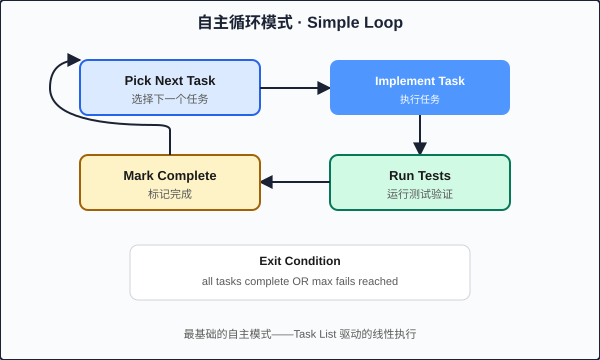

# 第二十六章：自主多代理流水线 (Autonomous Multi-Agent Pipelines)

> 当你信任系统到一定程度，可以让它在你睡觉时工作——这就是 autonomous pipeline 的愿景。

---

## 26.1 愿景：无人值守的编码会话

在前面的章节中，我们已经建立了 SDD 的核心工作流：specification 驱动 implementation，verification 确保质量。但每一步都需要人类参与——审查 plan、确认 implementation、触发 test。

想象另一种场景：

你在下班前写好 spec，配置好 pipeline，然后离开。第二天早上回来时，feature 已经实现完毕，所有 test 通过，code 已经 commit 到 feature branch 上，等待你的 review。

这不是科幻。这就是 **autonomous multi-agent pipeline** 的核心承诺。

但要实现这个愿景，我们需要解决三个关键问题：

1. **Permission control（权限控制）**：AI 能做什么、不能做什么？
2. **Loop architecture（循环架构）**：如何让 agent 自动迭代直到任务完成？
3. **Safety rails（安全护栏）**：当出错时如何优雅地停止？

---

## 26.2 Claude Code 的权限模式 (Permission Modes)

Claude Code 的权限系统是 autonomous pipeline 的基础设施。理解它的三个层级至关重要。

### 默认模式 (Default Mode)

每次 tool call 都需要人类确认：

```
Claude wants to: Write to src/auth.ts
[Allow] [Deny] [Allow for session]
```

这是最安全的模式，但完全无法用于 autonomous 场景。

### allowedTools 模式 (Pre-approved Tools)

在 `.claude/settings.json` 中预先批准特定工具：

```json
{
  "permissions": {
    "allowedTools": [
      "Read",
      "Write",
      "Edit",
      "Glob",
      "Grep",
      "Bash(npm test)",
      "Bash(npm run build)",
      "Bash(npm run lint)"
    ]
  }
}
```

这允许 AI 自由读写文件、运行测试，但不能执行任意 bash 命令。

### Autonomous 最佳实践 (The Sweet Spot)

autonomous pipeline 的理想权限配置是：

```
+------------------------------------------+
|  APPROVED (无需确认)                      |
|  - Read / Write / Edit files             |
|  - Run tests (npm test, pytest, etc.)    |
|  - Run linter / formatter                |
|  - Run build                             |
|  - Git add / commit                      |
+------------------------------------------+
|  REQUIRES APPROVAL (需要人类确认)         |
|  - Git push                              |
|  - Deploy commands                       |
|  - Install new dependencies              |
|  - Delete files outside project          |
|  - Network requests to external APIs     |
+------------------------------------------+
|  BLOCKED (永远禁止)                       |
|  - rm -rf / destructive commands         |
|  - Credential access                     |
|  - Production database operations        |
+------------------------------------------+
```

关键原则：**approve everything that's reversible, require approval for anything that's not.**（批准所有可逆操作，不可逆操作必须确认。）

---

## 26.3 自主循环模式 (Autonomous Loop Patterns)

### 模式一：Simple Loop（简单循环）

最基础的自主模式——task list 驱动的线性执行：

```
┌─────────────────────────────────────────┐
│                                         │
│  ┌──────────┐    ┌───────────┐         │
│  │ Pick Next│───>│ Implement │         │
│  │   Task   │    │   Task    │         │
│  └──────────┘    └─────┬─────┘         │
│       ^                 │               │
│       │                 v               │
│  ┌────┴─────┐    ┌───────────┐         │
│  │   Mark   │<───│ Run Tests │         │
│  │ Complete │    │           │         │
│  └──────────┘    └───────────┘         │
│                                         │
│  Exit: all tasks complete OR max fails  │
└─────────────────────────────────────────┘
```



实现方式：

```markdown
# Autonomous Simple Loop Prompt

你是一个 autonomous implementation agent。按照以下循环工作：

1. 读取 task-list.md，找到第一个状态为 [ ] 的任务
2. 读取对应的 spec file 获取 acceptance criteria
3. 实现该任务
4. 运行测试：npm test
5. 如果测试通过：标记任务为 [x]，commit，回到步骤 1
6. 如果测试失败：修复问题，最多重试 3 次
7. 如果 3 次重试后仍失败：标记为 [!] BLOCKED，回到步骤 1
8. 所有任务完成后停止
```

优点：简单、可预测、容易审计。
缺点：线性执行，无质量提升循环。

### 模式二：GAN Loop（生成-评估循环）

借鉴 GAN (Generative Adversarial Network) 的思想，让两个 agent 对抗迭代：

```
┌─────────────────────────────────────────────┐
│                                             │
│  ┌────────────┐         ┌────────────┐     │
│  │ Generator  │────────>│ Evaluator  │     │
│  │  (实现者)   │         │  (评估者)   │     │
│  └─────┬──────┘         └──────┬─────┘     │
│        ^                       │            │
│        │    Score < threshold  │            │
│        └───────────────────────┘            │
│                                             │
│        Exit: Score >= threshold             │
│              OR max iterations              │
└─────────────────────────────────────────────┘
```

Generator agent 负责写代码，Evaluator agent 对代码进行评分（correctness、performance、readability、security）。只有当所有维度都达到阈值时，才会通过。

```markdown
# Evaluator Prompt

评估以下代码的质量，按 1-10 打分：

- Correctness（正确性）：代码是否满足 spec 中的所有 acceptance criteria？
- Performance（性能）：是否有明显的性能问题？
- Readability（可读性）：命名是否清晰？结构是否合理？
- Security（安全性）：是否有安全漏洞？

阈值：所有维度 >= 7，Correctness >= 9

如果未达标，返回具体的改进建议列表。
```

优点：质量有保证，不断迭代提升。
缺点：成本高（每次迭代两个 agent call），可能陷入无限循环。

### 模式三：Pipeline（流水线）

最强大的模式——多个专业化 agent 组成 chain，每个 agent 只负责一个阶段：

```
┌──────────┐   ┌──────────┐   ┌──────────────┐   ┌──────────┐   ┌──────────┐
│Researcher│──>│ Planner  │──>│ Implementer  │──>│ Verifier │──>│ Reviewer │
│  研究者   │   │  规划者   │   │    实现者     │   │  验证者   │   │  审查者   │
└──────────┘   └──────────┘   └──────────────┘   └──────────┘   └──────────┘
     │              │                │                  │              │
     v              v                v                  v              v
  research.md    plan.md         code files        test results   review.md
```

每个 agent 有独立的 context（参见第 27 章），专注于自己的角色，产出 artifact 供下一阶段使用。

优点：context 隔离、专业化、可并行。
缺点：架构复杂、agent 间通信开销。

---

## 26.4 构建 SDD Autonomous Pipeline

让我们设计一个完整的 5 阶段 autonomous SDD pipeline：

### Phase 1: Research（研究阶段）

3 个 parallel agent 同时探索：

```
Agent 1: Codebase Explorer
  - 扫描项目结构
  - 识别相关模块
  - 产出：codebase-map.md

Agent 2: Dependency Analyzer
  - 分析现有 API 和接口
  - 识别需要修改的文件
  - 产出：dependency-analysis.md

Agent 3: Pattern Finder
  - 寻找项目中的既有模式
  - 确保新代码风格一致
  - 产出：patterns-found.md
```

### Phase 2: Planning（规划阶段）

Planner agent 综合 Phase 1 的 3 份报告 + 原始 spec，生成 implementation plan：

```
Input:  spec.md + codebase-map.md + dependency-analysis.md + patterns-found.md
Output: plan.md (with phases, tasks, risk areas)
```

### Phase 3: Task Decomposition（任务分解）

将 plan 转化为可执行的 atomic task list：

```markdown
# task-list.md

- [ ] TASK-1: Create database migration for users table
- [ ] TASK-2: Implement User model with validation
- [ ] TASK-3: Create UserRepository with CRUD operations
- [ ] TASK-4: Implement authentication middleware
- [ ] TASK-5: Add API routes for user endpoints
- [ ] TASK-6: Write integration tests
```

### Phase 4: Implementation Loop（实现循环）

对每个 task 执行 GAN loop：

```
For each task in task-list.md:
  ┌─────────────────────────────────────────┐
  │ 1. Implementer writes code              │
  │ 2. Verifier checks against spec         │
  │    - Run unit tests                     │
  │    - Check acceptance criteria          │
  │    - Verify no regressions              │
  │ 3. If PASS → git commit → next task     │
  │ 4. If FAIL → feedback to Implementer    │
  │    - Max 3 retries per task             │
  │    - After 3 fails → mark BLOCKED       │
  └─────────────────────────────────────────┘
```

### Phase 5: Final Verification（最终验证）

全量验证：

```bash
npm run lint          # Code style
npm run type-check    # Type safety
npm test              # Full test suite
npm run build         # Production build
```

只有所有检查都通过，pipeline 才标记为 SUCCESS。

---

## 26.5 安全护栏 (Safety Rails)

Autonomous 不等于 uncontrolled。以下 safety rails 是必须的：

### Abort Gates（中止门）

```
规则：连续 3 次 task 失败，整个 pipeline 中止。

原因：连续失败通常意味着系统性问题（spec 不清晰、
依赖缺失、架构冲突），继续执行只会浪费资源。
```

### Escalation Protocol（升级协议）

某些情况必须标记 `HUMAN_REQUIRED` 并暂停：

- Spec 中发现矛盾或歧义
- 需要安装新的 dependency
- 测试覆盖率低于阈值
- 发现潜在 security vulnerability
- 需要修改 shared infrastructure

```markdown
# escalation-log.md

## HUMAN_REQUIRED #1
- Task: TASK-4 (authentication middleware)
- Reason: Spec says "use OAuth2" but no OAuth provider configured
- Suggestion: Add Google OAuth credentials to .env
- Status: WAITING
```

### Budget Limits（预算限制）

```json
{
  "pipeline": {
    "maxTurnsPerAgent": 50,
    "maxRetriesPerTask": 3,
    "totalTimeCapMinutes": 180,
    "maxTokenBudget": 2000000
  }
}
```

### Snapshot/Restore（快照/恢复）

```
每个 task 开始前：git commit -m "checkpoint: before TASK-N"
Task 失败超过 max retries：git reset --hard 到 checkpoint
```

这确保失败的尝试不会污染代码库。

---

## 26.6 Overnight Coding 场景

一个典型的 overnight autonomous pipeline 工作流：

```
18:00  开发者准备：
       - 完善 spec（确保无歧义）
       - 配置 pipeline settings
       - 运行 dry-run（验证 pipeline 配置）
       - 设置 notification webhook

18:30  启动 pipeline
       - Pipeline 开始 Phase 1

00:00  Pipeline 状态：
       - Phase 1-3 完成
       - Phase 4: 6/8 tasks complete
       - 1 task BLOCKED (标记为 HUMAN_REQUIRED)

06:00  Pipeline 完成：
       - 7/8 tasks implemented and tested
       - 1 task waiting for human input
       - Final verification: PASS (for completed tasks)

08:00  开发者到达：
       - 审查 quality-timeline.jsonl
       - Review all commits
       - 解决 BLOCKED task
       - 手动触发 final phase
```

---

## 26.7 审计追踪：quality-timeline.jsonl

每个 agent 的每个决策都应记录到 audit trail：

```jsonl
{"ts":"2026-06-10T18:31:00Z","phase":"research","agent":"codebase-explorer","action":"read_file","target":"src/index.ts","result":"success"}
{"ts":"2026-06-10T18:45:00Z","phase":"planning","agent":"planner","action":"generate_plan","tasks":8,"risks":2}
{"ts":"2026-06-10T19:02:00Z","phase":"implement","agent":"implementer","task":"TASK-1","action":"write_file","target":"src/models/user.ts","result":"success"}
{"ts":"2026-06-10T19:03:00Z","phase":"verify","agent":"verifier","task":"TASK-1","action":"run_tests","passed":5,"failed":0}
{"ts":"2026-06-10T19:03:30Z","phase":"implement","agent":"implementer","task":"TASK-1","action":"commit","message":"feat: add User model with validation"}
{"ts":"2026-06-10T20:15:00Z","phase":"implement","agent":"implementer","task":"TASK-4","action":"escalate","reason":"OAuth provider not configured","status":"HUMAN_REQUIRED"}
```

这份 log 让你在第二天早上能快速理解 pipeline 做了什么、为什么做、哪里出了问题。

---

## 26.8 何时不应使用 Autonomous Pipeline

Autonomous pipeline 强大但并非万能。以下场景应避免：

| 场景 | 原因 |
|------|------|
| 需求不明确 | AI 会做出错误假设，产出大量无用代码 |
| Security-sensitive code | 认证、支付、加密等需要人类审查每一行 |
| Architectural decisions | 架构选择需要 domain expertise 和长期思考 |
| 新技术栈探索 | AI 对不熟悉的工具可能产出低质量代码 |
| 跨团队 API 设计 | 需要多方协商，不适合自动化 |
| UI/UX 设计实现 | 视觉效果需要人类判断 |

**经验法则**：如果 spec 写完后你有信心说"任何合格的工程师都能照着实现"，那就适合 autonomous pipeline。如果你自己实现时还需要边做边想，那就不适合。

---

## 26.9 实战示例：配置一个 5 阶段 Pipeline

假设我们要为一个 Todo 应用实现 CRUD API。以下是完整的 pipeline 配置：

```yaml
# pipeline-config.yaml

name: "todo-crud-pipeline"
spec: "./specs/todo-crud-spec.md"
output_branch: "feat/todo-crud"

phases:
  - name: research
    parallel: true
    agents:
      - role: codebase-explorer
        prompt: "Explore the project structure. Output: codebase-map.md"
      - role: dependency-analyzer
        prompt: "Identify existing models, routes, and database patterns. Output: dependency-analysis.md"
      - role: pattern-finder
        prompt: "Find coding patterns (naming, error handling, response format). Output: patterns-found.md"

  - name: planning
    agents:
      - role: planner
        input: ["spec.md", "codebase-map.md", "dependency-analysis.md", "patterns-found.md"]
        prompt: "Create implementation plan. Output: plan.md"

  - name: decomposition
    agents:
      - role: decomposer
        input: ["plan.md"]
        prompt: "Break plan into atomic tasks. Output: task-list.md"

  - name: implementation
    loop: true
    max_retries: 3
    agents:
      - role: implementer
        prompt: "Implement the current task following project patterns."
      - role: verifier
        prompt: "Run tests. Check acceptance criteria. Return PASS or FAIL with details."

  - name: final-verification
    agents:
      - role: full-verifier
        commands: ["npm run lint", "npm run type-check", "npm test", "npm run build"]

safety:
  abort_after_consecutive_failures: 3
  max_turns_per_agent: 50
  total_time_cap_minutes: 120
  escalation_triggers:
    - "security vulnerability"
    - "missing dependency"
    - "spec ambiguity"
```

这个配置文件定义了整个 pipeline 的行为。虽然当前 Claude Code 还没有原生的 pipeline orchestrator（截至 2026 年中），但你可以用 shell script + Claude Code CLI 来实现类似效果，或使用第三方 orchestration framework。

---

## 26.10 从简单开始

不要一开始就追求 5 阶段 overnight pipeline。推荐的 adoption path：

```
Level 1: 手动执行每个阶段，但用 agent 完成每个阶段内的工作
Level 2: 允许 Simple Loop（自动完成 task list）
Level 3: 添加 GAN Loop（自动质量检查）
Level 4: 完整 Pipeline（多阶段自动流转）
Level 5: Overnight（无人值守 + notification）
```

每升一级，你需要更完善的 spec、更严格的 safety rails、更丰富的 test suite。

---

## Key Takeaways (要点回顾)

1. **Autonomous pipeline 的核心是权限设计**：approve reversible operations, block irreversible ones. 正确的 `allowedTools` 配置是基础。

2. **三种循环模式适用于不同场景**：Simple Loop 适合明确任务，GAN Loop 适合质量敏感任务，Pipeline 适合复杂多阶段工作。

3. **Safety rails 不是可选的**：abort gates、escalation protocol、budget limits 和 snapshot/restore 缺一不可。

4. **Spec 质量决定 pipeline 质量**：autonomous 系统只能执行明确的指令，含糊的 spec 会导致灾难性结果。

5. **渐进式采用**：从 Level 1 开始，逐步提升自动化程度，在每一级都建立信任后再升级。

---

下一章，我们将探讨 autonomous pipeline 的一个关键瓶颈——context window 管理，以及如何在有限的 token 预算内最大化 agent 的效能。
