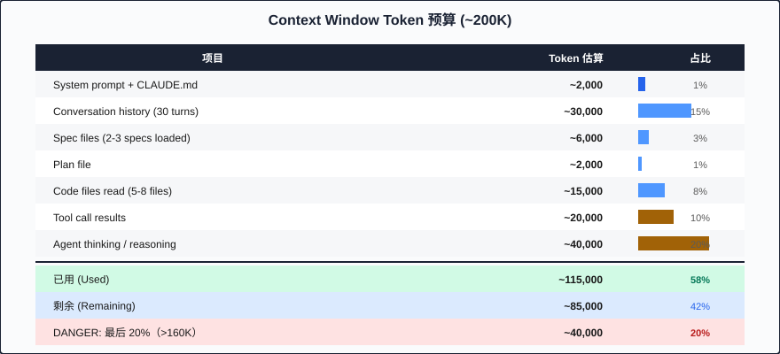

# 第二十七章：上下文管理策略 (Context Window Management)

> Context window 是 AI agent 的工作记忆——管理它的方式决定了 agent 的智力上限。

---

## 27.1 根本约束 (The Fundamental Constraint)

Claude Code 拥有约 200K token 的 context window。这听起来很大，但在一个活跃的 SDD session 中，context 的消耗速度远超预期。

让我们做一个 token 预算估算：

```
┌─────────────────────────────────────────────────┐
│           Context Window Budget (~200K)          │
├─────────────────────────────────────────────────┤
│ System prompt + CLAUDE.md        ~2,000 tokens  │
│ Conversation history (30 turns)  ~30,000 tokens │
│ Spec files (2-3 specs loaded)    ~6,000 tokens  │
│ Plan file                        ~2,000 tokens  │
│ Code files read (5-8 files)      ~15,000 tokens │
│ Tool call results                ~20,000 tokens │
│ Agent thinking/reasoning         ~40,000 tokens │
├─────────────────────────────────────────────────┤
│ Used                             ~115,000 tokens│
│ Remaining                        ~85,000 tokens │
│ "Safe zone" ends at 80%         ~160,000 tokens │
│ DANGER: last 20%                 ~40,000 tokens │
└─────────────────────────────────────────────────┘
```



当你进入 context window 的最后 20% 时（大约 160K 以上），你会观察到：

- Agent 开始"忘记"早期对话中的细节
- 指令遵循能力下降
- 代码生成质量明显降低
- 更容易出现 hallucination

这就是 **"last 20% problem"（最后 20% 问题）**。

---

## 27.2 SDD Artifacts 如何争夺 Context

在 SDD 工作流中，多种 artifact 需要占据 context：

| Artifact | 加载时机 | 典型大小 | 持续性 |
|----------|---------|---------|-------|
| CLAUDE.md | Session 启动时自动加载 | 500-2000 tokens | 永久存在 |
| Spec files | 开始实现某 feature 时 | 1000-3000 tokens/file | 按需 |
| Plan files | 进入实现阶段时 | 1000-2000 tokens | 按需 |
| Code files (read) | 需要理解/修改代码时 | 500-5000 tokens/file | 按需 |
| Test output | 运行测试后 | 200-2000 tokens | 短暂 |
| Conversation history | 累积 | 持续增长 | 无法清除 |

关键观察：**conversation history 是不可逆的**。每一轮对话都永久占据 context，直到 session 结束。这意味着长 session 注定会遇到 context 压力。

---

## 27.3 Strategy 1: 子代理隔离 (Subagent Isolation)

这是最重要的 context management 策略。

### 原理

每个 subagent（通过 Task tool 调用）获得一个 **fresh context window**。它不继承父 session 的 conversation history，只接收你传给它的 prompt。

```
┌─────────────────────────────────────────┐
│  Main Session (Orchestrator)            │
│  Context: CLAUDE.md + high-level state  │
│  Role: coordinate, decide, delegate     │
│                                         │
│  ┌─────────┐  ┌─────────┐  ┌────────┐ │
│  │Subagent │  │Subagent │  │Subagent│ │
│  │  Fresh  │  │  Fresh  │  │  Fresh │ │
│  │ Context │  │ Context │  │Context │ │
│  └─────────┘  └─────────┘  └────────┘ │
└─────────────────────────────────────────┘
```

### 最佳实践

**重型任务（Heavy tasks）应该在 subagent 中执行：**

- 实现一个完整的 feature
- 阅读和分析大量代码文件
- 运行完整 test suite 并分析结果
- 研究 codebase 结构

**主 session 应该保持轻量：**

- 管理 task list 状态
- 做 high-level 决策
- 协调 subagent 之间的依赖
- 记录 progress

### 示例

```markdown
# 主 session 的 prompt pattern

我正在实现 todo-crud feature。当前 task list：

- [x] TASK-1: Database migration ✓
- [ ] TASK-2: User model
- [ ] TASK-3: API routes

请使用 subagent 实现 TASK-2。给 subagent 以下 context：
- spec: specs/todo-crud-spec.md (Section 2: Data Model)
- pattern reference: src/models/existing-model.ts
- Output: src/models/user.ts + src/models/user.test.ts
```

subagent 拿到的是一个精简的、focused context，不包含主 session 积累的 30 轮对话历史。

---

## 27.4 Strategy 2: 分层上下文加载 (Hierarchical Context Loading)

不是所有信息都同等重要。用分层策略管理 context 加载：

```
┌─────────────────────────────────────────────┐
│  Level 0: Constitution (always loaded)      │
│  ─────────────────────────────────────────  │
│  CLAUDE.md: project rules, conventions      │
│  ~500-2000 tokens                           │
├─────────────────────────────────────────────┤
│  Level 1: Feature Context (per feature)     │
│  ─────────────────────────────────────────  │
│  Current spec + current plan                │
│  ~2000-5000 tokens                          │
├─────────────────────────────────────────────┤
│  Level 2: Task Context (per task)           │
│  ─────────────────────────────────────────  │
│  Specific code files for current task       │
│  Test files related to current task         │
│  ~2000-10000 tokens                         │
├─────────────────────────────────────────────┤
│  Level 3: Reference (on demand)             │
│  ─────────────────────────────────────────  │
│  Other module code, docs, examples          │
│  Load only when actively needed             │
│  ~variable                                  │
└─────────────────────────────────────────────┘
```

### 关键原则

1. **Never load everything at once**（永远不要一次加载所有内容）
2. **Load at the moment of need**（在需要的时刻才加载）
3. **Prefer IDs over full content**（优先使用 ID 引用而非全文）

### 反模式

```markdown
# BAD: 一次性加载全部 spec
请阅读以下文件然后开始实现：
- specs/user-spec.md
- specs/auth-spec.md  
- specs/payment-spec.md
- src/models/*.ts (全部 12 个文件)
- src/routes/*.ts (全部 8 个文件)
```

```markdown
# GOOD: 只加载当前需要的
当前任务：TASK-2 (User model)
需要的 context：
- specs/user-spec.md (Section 2 only: Data Model)
- src/models/base-model.ts (作为 pattern reference)
```

---

## 27.5 Strategy 3: 会话检查点 (Session Checkpointing)

Git 不仅是版本控制工具——它是 AI agent 的 **external memory**。

### 原理

当你频繁 commit 并使用 descriptive messages 时，你实际上是在创建一个持久化的、可搜索的 "记忆库"：

```bash
git log --oneline -20
# a1b2c3d feat: add User model with email validation
# d4e5f6g feat: add UserRepository with CRUD
# h7i8j9k test: add unit tests for User model
# l0m1n2o refactor: extract validation logic to shared util
```

### Session Boundary Rules（会话边界规则）

```
开始新 session 的信号：
- Context 使用超过 70%
- 切换到不同的 feature
- 完成一个完整的 phase (research → planning → implementation)
- 遇到需要不同 skill set 的工作
- 调试了超过 10 轮仍未解决

不要开始新 session 的情况：
- 当前 task 正在进行中
- 有未 commit 的更改
- 正在调试一个明确的 bug（快接近答案了）
```

### 跨 Session 的连续性

在 session 结束时，commit 一个状态摘要：

```markdown
# SESSION-END-NOTE.md (临时文件，下次 session 启动时读取)

## 完成的工作
- TASK-1 through TASK-4 implemented and tested
- All tests passing

## 当前状态
- Working on TASK-5 (API routes)
- file: src/routes/user.ts is partially complete
- Blocked: need to decide on error response format

## 下一步
- Finish TASK-5 error handling
- Implement TASK-6 (integration tests)
- Run full test suite
```

新 session 开始时，读取这个文件即可快速恢复上下文。

---

## 27.6 Strategy 4: Prompt Cache 优化 (Prompt Cache Optimization)

Claude 的 prompt cache 可以显著减少成本和延迟，但它有一个关键特性需要了解。

### Prompt Cache 的工作原理

```
┌───────────────────────────────────────────────┐
│              Prompt Cache                      │
│                                               │
│  TTL (Time To Live): 5 minutes                │
│                                               │
│  Cache hit: 读取速度快，成本低（90% 折扣）       │
│  Cache miss: 需要重新处理所有 prefix tokens     │
│                                               │
│  Cache key: 消息序列的 exact prefix match      │
└───────────────────────────────────────────────┘
```

### 优化策略

**保持 session 活跃以维持 cache warm：**

```
活跃 session (agent 调用间隔 < 5 min):
  [Call 1] ──── 2min ──── [Call 2] ──── 3min ──── [Call 3]
                 ✓ cache hit        ✓ cache hit

非活跃 session (间隔 > 5 min):
  [Call 1] ──── 7min ──── [Call 2]
                 ✗ cache miss (重新处理全部 prefix)
```

**对于 subagent 调用：**

- 如果你要连续调用多个 subagent，尽量在 270 秒内完成调度
- 如果超过 300 秒（5 分钟），接受 cache miss 并批量处理

**长时间思考时的策略：**

- 如果你需要人类思考超过 5 分钟才给 AI 下一个指令，考虑把指令预先写好，快速连续发送
- 或者接受 cache miss 的额外成本，不要为了"省钱"而匆忙给出低质量指令

---

## 27.7 Strategy 5: 规格压缩 (Spec Compression)

同一个 spec 在不同阶段需要不同的详细程度。

### Full Spec（完整规格）—— Planning 阶段使用

```markdown
# User Management Spec

## REQ-1: User Registration
Users SHALL be able to register with email and password.

### Acceptance Criteria
- AC-1.1: Email must be valid format (RFC 5322)
- AC-1.2: Password minimum 8 characters, 1 uppercase, 1 number
- AC-1.3: Duplicate email returns 409 Conflict
- AC-1.4: Successful registration returns 201 with user object (no password)
- AC-1.5: Registration sends verification email

### Technical Notes
- Use bcrypt with cost factor 12 for password hashing
- Store email in lowercase
- Generate UUID v4 for user ID
```

### Compressed Spec（压缩规格）—— Implementation 阶段使用

```markdown
# Compressed: User Management

Implement REQ-1 (User Registration):
- AC-1.1: valid email (RFC 5322)
- AC-1.2: password: 8+ chars, 1 upper, 1 number
- AC-1.3: duplicate → 409
- AC-1.4: success → 201, user object sans password
- AC-1.5: send verification email
- Tech: bcrypt cost 12, lowercase email, UUID v4
```

### Reference-Only Spec（引用规格）—— 相关但非当前任务

```markdown
See: specs/user-spec.md#REQ-1
```

### 压缩比对比

| 形式 | Tokens (估算) | 适用场景 |
|------|-------------|---------|
| Full spec | ~800 | Planning, architecture review |
| Compressed | ~200 | Active implementation |
| Reference-only | ~20 | Cross-reference, not current task |

通过在 implementation 阶段使用 compressed spec 而非 full spec，你可以节省 75% 的 context budget，同时保留所有关键信息。

---

## 27.8 上下文预算规划 (Context Budget Planning)

在开始一个 SDD session 前，预估 context 消耗：

```
┌─────────────────────────────────────────────────────┐
│  Session Plan: Implement User CRUD                  │
├─────────────────────────────────────────────────────┤
│  Fixed overhead:                                    │
│    System prompt + CLAUDE.md         2,000 tokens   │
│                                                     │
│  Phase 1: Planning (~10 turns)                      │
│    Spec loading (full)               3,000 tokens   │
│    Conversation                     10,000 tokens   │
│    Plan generation                   2,000 tokens   │
│    Subtotal:                        ~17,000 tokens  │
│                                                     │
│  Phase 2: Implementation (~30 turns)                │
│    Spec (compressed)                   500 tokens   │
│    Code reads (5 files)              8,000 tokens   │
│    Code writes (tool results)       10,000 tokens   │
│    Test results                      3,000 tokens   │
│    Conversation                     30,000 tokens   │
│    Subtotal:                        ~51,500 tokens  │
│                                                     │
│  Phase 3: Verification (~10 turns)                  │
│    Full test output                  5,000 tokens   │
│    Build output                      2,000 tokens   │
│    Conversation                     10,000 tokens   │
│    Subtotal:                        ~17,000 tokens  │
│                                                     │
│  TOTAL ESTIMATED:                   ~87,500 tokens  │
│  Safety margin (20%):              ~175,000 tokens  │
│  VERDICT: Fits in single session ✓                  │
└─────────────────────────────────────────────────────┘
```

如果估算超过 160K（80% 容量），你应该：

1. 将工作拆分为多个 session
2. 更多地使用 subagent（它们有自己的 context）
3. 更积极地使用 compressed spec

---

## 27.9 "Fresh Eyes" 的好处 (The Fresh Eyes Benefit)

反直觉的观察：**新 session 有时比长 session 产出更好的结果**。

原因：

1. **没有 anchoring bias（锚定偏差）**：长 session 中，AI 可能被早期对话中的错误方向"锚定"
2. **Full context budget**：所有 200K tokens 都可用于当前任务
3. **最优 attention**：Transformer 的 attention mechanism 在 context 较短时效率更高
4. **No accumulated errors**：对话中的每一个小误解都会累积

### 何时主动选择 "fresh eyes"

```
信号：
- AI 连续 5 轮给出相似但不正确的答案
- 你感觉 AI "固执地"走错误方向
- Debug session 超过 15 轮未解决
- AI 开始重复之前说过的话

行动：
1. Commit 当前进度
2. 写一个清晰的状态摘要
3. 开始新 session
4. 在新 session 中，直接描述问题而非对话历史
```

---

## 27.10 实用工具：Context 监控

虽然 Claude Code 不直接暴露 token count，但你可以通过以下方式估算：

```
经验公式：
- 1 token ≈ 4 characters (English)
- 1 token ≈ 1.5 characters (Chinese)
- 1 对话 turn (user + assistant) ≈ 500-2000 tokens
- 1 code file read ≈ file_lines × 5 tokens

警告信号：
- Session 超过 40 轮对话
- 加载了超过 10 个 code files
- AI response 开始变短或重复
- AI 忘记早期对话中的指令
```

---

## Key Takeaways (要点回顾)

1. **Context window 是有限资源**：200K tokens 看似很多，但 SDD session 的各种 artifact 会快速消耗。规划 context budget 如同规划 memory budget。

2. **Subagent 是最强大的 context management 工具**：每个 subagent 获得 fresh context，让主 session 保持轻量。重型任务永远应该 delegate 到 subagent。

3. **分层加载，而非全量加载**：Level 0 → 1 → 2 → 3，只在需要时才加载更详细的信息。Compressed spec 在 implementation 阶段就足够了。

4. **Git 是 external memory**：频繁 commit 意味着你可以安全地开始新 session，因为所有进度都持久化在 git history 中。

5. **不要害怕开始新 session**：fresh context 的 "fresh eyes" 效应经常比 long context 的"记忆连续"更有价值。当你感觉 context 变"沉重"时，checkpoint 并重新开始。

---

下一章，我们将探讨如何将 SDD 从个人实践扩展到团队协作，包括 shared constitution、spec review workflow 和 CI/CD integration。
