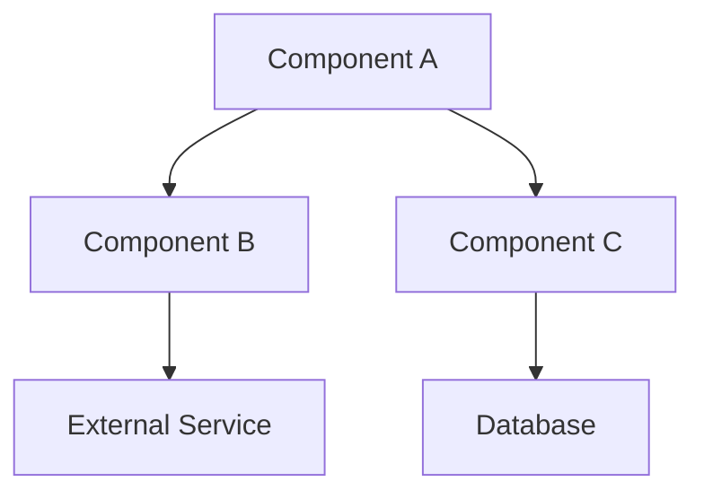
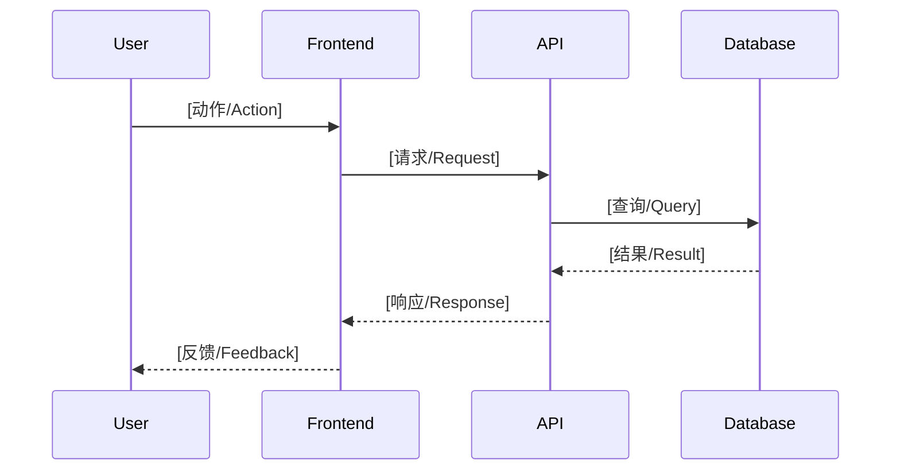
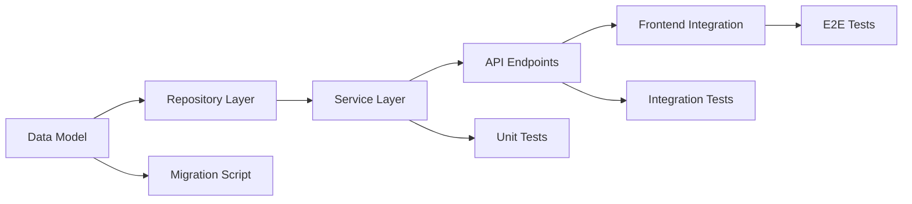

# Implementation Plan Template / 实施计划模板

> **用途 / Usage**: 规格审批后、任务分解前创建此文件。它将规格翻译为技术实现方案。
> Create this file after spec approval, before task decomposition. It translates the spec into a technical implementation approach.
>
> **输入 / Input**: 已批准的规格文件 (spec)
> **输出 / Output**: 可执行的技术方案，作为任务分解的依据
>
> **命名约定 / Naming**: `plans/SPEC-XXX-plan.md`

---

## Metadata / 元数据

| Field | Value |
|-------|-------|
| **Plan ID** | [e.g., PLAN-001] |
| **Spec Reference** | [e.g., SPEC-001] |
| **Author** | [作者 / Author] |
| **Created** | [YYYY-MM-DD] |
| **Status** | [Draft / Review / Approved] |

---

## Architecture Decisions / 架构决策

<!-- 
  填写说明：列出实现此功能所需的关键技术决策。每个决策使用 ADR 精简格式。
  Instructions: List key technical decisions needed for this feature. Use lightweight ADR format for each.
-->

### AD-01: [决策标题 / Decision title]

- **Context / 背景**: [为什么需要做这个决策 / Why this decision is needed]
- **Options Considered / 考虑的选项**:
  1. [选项A / Option A] — [优点/pros] / [缺点/cons]
  2. [选项B / Option B] — [优点/pros] / [缺点/cons]
  3. [选项C / Option C] — [优点/pros] / [缺点/cons]
- **Decision / 决定**: [选择了哪个选项 / Which option was chosen]
- **Rationale / 理由**: [为什么选择它 / Why it was chosen]
- **Consequences / 后果**: [这个决策带来的影响 / Implications of this decision]

### AD-02: [决策标题 / Decision title]

- **Context / 背景**: [...]
- **Options Considered / 考虑的选项**: [...]
- **Decision / 决定**: [...]
- **Rationale / 理由**: [...]
- **Consequences / 后果**: [...]

---

## System Design / 系统设计

<!-- 
  填写说明：描述组件之间的关系。使用文本图或 Mermaid 语法。
  Instructions: Describe relationships between components. Use text diagrams or Mermaid syntax.
-->

### Component Diagram / 组件图



<!-- 
  替换为实际的组件图 / Replace with actual component diagram.
  标注数据流方向和通信协议 / Annotate data flow direction and communication protocols.
-->

### Component Responsibilities / 组件职责

| Component | Responsibility | Interface |
|-----------|---------------|-----------|
| [组件名 / Name] | [职责 / Responsibility] | [接口类型 / Interface type] |
| [组件名 / Name] | [职责 / Responsibility] | [接口类型 / Interface type] |
| [组件名 / Name] | [职责 / Responsibility] | [接口类型 / Interface type] |

### Sequence Diagram / 序列图 (Optional)



---

## Data Model / 数据模型

<!-- 
  填写说明：定义新增或修改的数据结构。包括类型定义和数据库 schema 变更。
  Instructions: Define new or modified data structures. Include type definitions and database schema changes.
-->

### Type Definitions / 类型定义

```typescript
// 用你项目的语言替换 / Replace with your project's language

interface [EntityName] {
  id: string;
  // [字段 / fields...]
  createdAt: Date;
  updatedAt: Date;
}
```

### Database Schema Changes / 数据库变更

```sql
-- 新表或变更 / New tables or alterations

CREATE TABLE [table_name] (
  id UUID PRIMARY KEY DEFAULT gen_random_uuid(),
  -- [字段 / columns...]
  created_at TIMESTAMPTZ NOT NULL DEFAULT NOW(),
  updated_at TIMESTAMPTZ NOT NULL DEFAULT NOW()
);

-- 索引 / Indexes
CREATE INDEX idx_[table]_[column] ON [table_name]([column]);
```

### Data Flow / 数据流转

```
[Input Source] → [Validation] → [Transform] → [Storage] → [Output]
```

---

## File Structure Plan / 文件结构计划

<!-- 
  填写说明：列出此功能需要新增和修改的所有文件。
  Instructions: List all files that need to be created or modified for this feature.
-->

### New Files / 新增文件

```
src/
├── [module]/
│   ├── [file1].ts          — [用途 / Purpose]
│   ├── [file2].ts          — [用途 / Purpose]
│   └── [file3].ts          — [用途 / Purpose]
tests/
├── [module]/
│   ├── [file1].test.ts     — [测试内容 / What it tests]
│   └── [file2].test.ts     — [测试内容 / What it tests]
```

### Modified Files / 修改文件

| File | Change Description |
|------|-------------------|
| [path/to/file] | [修改描述 / What changes] |
| [path/to/file] | [修改描述 / What changes] |

---

## Dependency Graph / 依赖图

<!-- 
  填写说明：展示实现顺序的依赖关系。后续的任务分解将基于此图。
  Instructions: Show implementation order dependencies. Task decomposition will be based on this graph.
-->



### Critical Path / 关键路径

<!-- 影响交付时间的最长依赖链 / The longest dependency chain affecting delivery time -->

```
[Step 1] → [Step 2] → [Step 3] → [Step 4]
    ↓
[估计时间 / Estimated time: X hours/days]
```

---

## Risk Assessment / 风险评估

<!-- 
  填写说明：识别实现过程中可能遇到的风险及缓解策略。
  Instructions: Identify risks that may arise during implementation and mitigation strategies.
-->

| # | Risk | Likelihood | Impact | Mitigation |
|---|------|-----------|--------|-----------|
| 1 | [风险描述 / Risk description] | [High/Med/Low] | [High/Med/Low] | [缓解策略 / Mitigation strategy] |
| 2 | [风险描述 / Risk description] | [High/Med/Low] | [High/Med/Low] | [缓解策略 / Mitigation strategy] |
| 3 | [风险描述 / Risk description] | [High/Med/Low] | [High/Med/Low] | [缓解策略 / Mitigation strategy] |

---

## Implementation Phases / 实施阶段

<!-- 
  填写说明：将实现分解为可独立交付和验证的阶段。
  Instructions: Break implementation into independently deliverable and verifiable phases.
-->

### Phase 1: [阶段名称 / Phase name] (Foundation / 基础)

**Goal / 目标**: [此阶段完成后可以验证什么 / What can be verified after this phase]

- [ ] [交付物1 / Deliverable 1]
- [ ] [交付物2 / Deliverable 2]
- [ ] [交付物3 / Deliverable 3]

**Verification / 验证方式**: [如何验证此阶段完成 / How to verify this phase is complete]

### Phase 2: [阶段名称 / Phase name] (Core Logic / 核心逻辑)

**Goal / 目标**: [...]

- [ ] [交付物 / Deliverable]
- [ ] [交付物 / Deliverable]

**Verification / 验证方式**: [...]

### Phase 3: [阶段名称 / Phase name] (Integration / 集成)

**Goal / 目标**: [...]

- [ ] [交付物 / Deliverable]
- [ ] [交付物 / Deliverable]

**Verification / 验证方式**: [...]

### Phase 4: [阶段名称 / Phase name] (Polish / 完善)

**Goal / 目标**: [...]

- [ ] [交付物 / Deliverable]
- [ ] [交付物 / Deliverable]

**Verification / 验证方式**: [...]

---

## API Design / API 设计 (If applicable / 如适用)

<!-- 
  如果功能涉及 API 变更，定义端点。
  If the feature involves API changes, define endpoints.
-->

### Endpoints / 端点

#### `[METHOD] /api/v1/[resource]`

- **Purpose / 用途**: [...]
- **Auth / 认证**: [Required / Optional / None]
- **Request / 请求**:
  ```json
  {
    "field": "type — description"
  }
  ```
- **Response (200) / 响应**:
  ```json
  {
    "data": {},
    "meta": {}
  }
  ```
- **Errors / 错误**:
  - `400` — [描述 / Description]
  - `401` — [描述 / Description]
  - `404` — [描述 / Description]

---

## Performance Considerations / 性能考虑

<!-- 
  描述预期的负载和性能优化策略。
  Describe expected load and performance optimization strategies.
-->

- **Expected load / 预期负载**: [e.g., 100 requests/second]
- **Caching strategy / 缓存策略**: [e.g., Redis with 5min TTL]
- **Optimization notes / 优化备注**: [e.g., Use cursor-based pagination]

---

## Open Items / 待解决事项

<!-- 计划中仍需澄清的技术问题。 -->

| # | Item | Blocker? | Owner |
|---|------|----------|-------|
| 1 | [...] | [Yes/No] | [...] |
| 2 | [...] | [Yes/No] | [...] |
